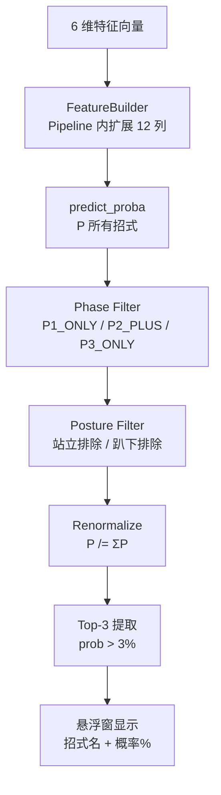

# Inference System — BlackDragon v1.2

> 推理系统（合并旧 LightGBM_Model + Model_Evaluation 的概览版）。模型规格见原 [[AI_Model/LightGBM_Model|LightGBM Model]]（现为 Production Model 页），评估见 [[AI_Model/Model_Evaluation|Model Evaluation]]。

## 1. 模型规格

| 属性 | 值 |
|------|-----|
| 框架 | XGBoost 3.4.1（sklearn Pipeline 封装；v1.2.0 起替代 LightGBM，ADR-P6.1） |
| 类型 | 多分类（Multiclass），190 树 / depth 4 |
| 结构 | `Pipeline[FeatureBuilder(src/model/features.py) → LabelDecodedEstimator(XGBClassifier)(src/model/label_decode.py)]` |
| 外部输入特征 | 6 维（Pipeline 内扩展 12 列） |
| 输出类别 | 46 个招式（`classes_` 即原始招式 ID，LabelDecodedEstimator 已解码） |
| 模型文件 | `models/fatalis_ai_model.pkl`（**7.46 MB**） |
| 加载 | `ActionPredictor(model_path)` — joblib.load；失败时 `logger.error`（含 traceback） |

## 2. 推理流程



**实现**：`ActionPredictor.predict()`（`src/model/predictor.py`）——对外契约与 v1.0 相同：

```python
predict(distance, relative_angle, posture, previous_action, phase, is_enraged)
  → [(class_id, prob), ...]
```

内部调用 static methods：`filter_probs_by_phase` → `filter_probs_by_posture` → `renormalize_probs` → `select_top_k(k=3, threshold=0.03)`。

**模型未加载**：`_model = None` → `predict()` 返回 `[]`；加载失败记入日志（含 traceback），Overlay UI 显示橙色 **"⚠ AI 模型未加载"** 提示（Nova 预警优先级更高）——AI 区不再可能无提示空白（v1.2.0 冻结包可观测性修复）。

## 3. 两层预测架构（核心创新）

纯 ML 预测可能输出物理上不可能的招式（如 P1 阶段预测 P3 专属招式）。两层架构通过**硬规则过滤**保证输出合法性：

| 层 | 机制 | 数据源 |
|----|------|--------|
| ML 层 | `predict_proba()` → 所有招式概率 | `models/fatalis_ai_model.pkl`（XGBoost Pipeline） |
| 物理规则层 | Phase 过滤 + Posture 过滤 → 重归一化 → Top-3 | `src/config/actions.py` 的 `P1_ONLY_IDS` 等 |

## 4. 特征（6 输入 → 12 列）

| # | 特征 | 类型 | 来源 |
|---|------|------|------|
| 0 | distance | float | `calc_distance_2d` |
| 1 | relative_angle | float | `calc_relative_angle` |
| 2 | posture | category(5) | `CombatStateTracker` FSM |
| 3 | previous_action | category(N) | `ACTION_MAPPING` 合并后 |
| 4 | phase | category(3) | HP% 推导 |
| 5 | is_enraged | category(2) | 硬件级读取 |

推理接口只传以上 6 维；Pipeline 内 `FeatureBuilder` 自动扩展出 `distance_bin` / `posture_x_phase` / `prev_action_freq` / `distance_x_enraged` / `angle_sin` / `angle_cos` 共 12 列。详见 [[AI_Model/Feature_Engineering|Feature Engineering]]。

## 5. 推理性能

| 指标 | 值 |
|------|-----|
| 推理触发 | 每 0.5s（`_AI_THROTTLE_INTERVAL`，OverlayUI 内） |
| 单次延迟 | p95 4.31ms（留出集实测，v1.2.0） |
| 推理 CPU | 单线程（pickle 内嵌 n_jobs=1），cpu_mean ~2.3% |
| 模型加载 | joblib.load；加载 RSS 增量 ~122MB（xgboost booster 反序列化固有代价，用户裁决接受） |
| 预测节流 | 仅动作变化后 0.5s 内执行一次（`_last_ai_time` 游标） |

## 6. 评估指标

| 指标 | 说明 | v1.2.0（留出集 488 行 / 46 类） |
|------|------|------|
| top1 | Top-1 命中率 | **32.58%** |
| top3_raw | 真实标签在 Top-3 中的比例 | **66.19%** |
| top3_filtered | 硬过滤后（**实战核心**） | **65.37%** |

### 特征重要性（v1.2.0 gain 实测）

前三：`distance_bin` 14.68%、`posture` 14.58%、`posture_x_phase` 14.08%；派生 6 列合计 50.71%。完整表见 [[AI_Model/Feature_Engineering|Feature Engineering]]。

## 7. selftest 自检（v1.2.0）

双 EXE 均支持 `--selftest`：在真实 EXE 进程内执行"路径解析 → 模型加载 → 一次 predict"，exit 0/1。`build_exe.ps1` 第 7 步自动跑双 EXE selftest，任一失败即构建失败（硬门禁）；Overlay 特意以 CWD=TEMP 运行以覆盖 frozen 路径解析场景。

## 8. 显示层（OverlayUI）

- 绿色文本：`预测下一招: 龙车 45.0% / 连咬 30.0% / ...`
- 红色文本：Nova 预警（`【飞天火预警】血线触发，请立刻准备规避！`）
- Nova 优先于预测（触发时跳过推理）
- 橙色提示：`⚠ AI 模型未加载`（模型加载失败时，替代空白 AI 区）

## 9. 推理触发链路（双进程）

Dashboard 与 Overlay 两个进程**各自独立**加载模型并推理：

```
Dashboard 进程:
  GameService daemon → attach_game → P4 模块
  → (状态栏显示 is_model_loaded)

Overlay 进程（独立子进程）:
  _find_game_process()  ← 自行连接游戏（重试循环）
    → MemoryReader → StateTracker → ActionPredictor
    → OverlayUI.update_logic() → predict()
```

**关键区分**：
- **Dashboard**：`GameService` 负责检测游戏进程，附着后仅持有模型引用用于状态显示
- **Overlay**：通过 `overlay.py` main() 中的 `_find_game_process()` **自行**连接游戏（不依赖 GameService）——详见 [[Architecture/Process_Architecture|Process Architecture]]

Overlay 是主要推理消费者；Dashboard 进程仅用于 `is_model_loaded` 状态显示。
