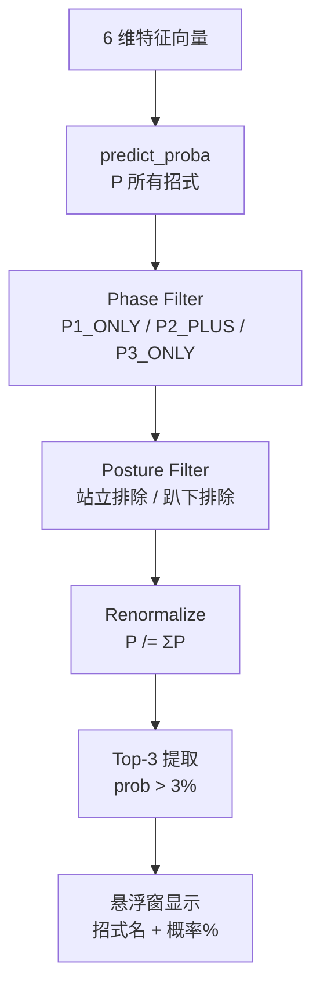

# Inference System — BlackDragon v1.0

> 推理系统（合并旧 LightGBM_Model + Model_Evaluation 的概览版）。模型规格见原 [[AI_Model/LightGBM_Model|LightGBM Model]]，评估见 [[AI_Model/Model_Evaluation|Model Evaluation]]。

## 1. 模型规格

| 属性 | 值 |
|------|-----|
| 框架 | LightGBM 4.6.0 |
| 类型 | 多分类（Multiclass） |
| 输入特征 | 6 维 |
| 输出类别 | ~40-60 个招式 |
| 模型文件 | `models/fatalis_ai_model.pkl` (~18 MB) |
| 加载 | `ActionPredictor(model_path)` — joblib.load |

## 2. 推理流程



**实现**：`ActionPredictor.predict()`（`src/model/predictor.py`）：

```python
predict(distance, relative_angle, posture, previous_action, phase, is_enraged)
  → [(class_id, prob), ...]
```

内部调用 static methods：`filter_probs_by_phase` → `filter_probs_by_posture` → `renormalize_probs` → `select_top_k(k=3, threshold=0.03)`。

**模型未加载**：`_model = None` → `predict()` 返回 `[]`。

## 3. 两层预测架构（核心创新）

纯 ML 预测可能输出物理上不可能的招式（如 P1 阶段预测 P3 专属招式）。两层架构通过**硬规则过滤**保证输出合法性：

| 层 | 机制 | 数据源 |
|----|------|--------|
| ML 层 | `predict_proba()` → 所有招式概率 | `models/fatalis_ai_model.pkl` |
| 物理规则层 | Phase 过滤 + Posture 过滤 → 重归一化 → Top-3 | `src/config/actions.py` 的 `P1_ONLY_IDS` 等 |

## 4. 6 维特征

| # | 特征 | 类型 | 来源 |
|---|------|------|------|
| 0 | distance | float | `calc_distance_2d` |
| 1 | relative_angle | float | `calc_relative_angle` |
| 2 | posture | category(5) | `CombatStateTracker` FSM |
| 3 | previous_action | category(N) | `ACTION_MAPPING` 合并后 |
| 4 | phase | category(3) | HP% 推导 |
| 5 | is_enraged | category(2) | 硬件级读取 |

详见 [[AI_Model/Feature_Engineering|Feature Engineering]]。

## 5. 推理性能

| 指标 | 值 |
|------|-----|
| 推理触发 | 每 0.5s（`_AI_THROTTLE_INTERVAL`，OverlayUI 内） |
| 单次延迟 | < 5ms |
| 模型加载 | < 1s |
| 预测节流 | 仅动作变化后 0.5s 内执行一次（`_last_ai_time` 游标） |

## 6. 评估指标

| 指标 | 说明 | 基线 |
|------|------|------|
| Accuracy | Top-1 命中率 | 见最新训练 |
| Top-3 命中率 | 真实标签在 Top-3 中的比例（**实战核心**） | 56.17%（v0.1.0, 17 场狩猎） |

### 特征重要性（预期排序）

1. `previous_action`（最高——招式连段）
2. `phase`（高——招式池变化）
3. `posture`（高——姿态限制）
4. `distance`（中）
5. `relative_angle`（中）
6. `is_enraged`（低~中）

## 7. 显示层（OverlayUI）

- 绿色文本：`预测下一招: 龙车 45.0% / 连咬 30.0% / ...`
- 红色文本：Nova 预警（`【飞天火预警】血线触发，请立刻准备规避！`）
- Nova 优先于预测（触发时跳过推理）

## 8. 推理触发链路（双进程）

Dashboard 与 Overlay 两个进程**各自独立**加载模型并推理：

```
Dashboard 进程:
  GameService daemon → attach_game → P4 模块
  → (状态栏显示 is_model_loaded)

Overlay 进程（独立子进程）:
  _find_game_process()  ← 自行连接游戏（重试循环）
    → MemoryReader → StateTracker → ActionPredictor
    → OverlayUI.update_logic() → predict()
```

**关键区分**：
- **Dashboard**：`GameService` 负责检测游戏进程，附着后仅持有模型引用用于状态显示
- **Overlay**：通过 `overlay.py` main() 中的 `_find_game_process()` **自行**连接游戏（不依赖 GameService）——详见 [[Architecture/Process_Architecture|Process Architecture]]

Overlay 是主要推理消费者；Dashboard 进程仅用于 `is_model_loaded` 状态显示。
