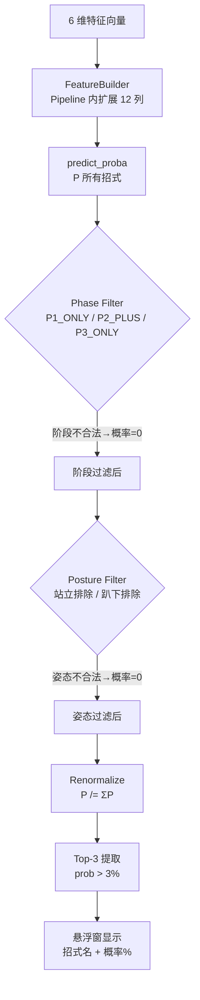

# Production Model（XGBoost Pipeline）

> [!info] 本页历史与现状
> 本页原为 LightGBM 模型规格页（文件名保留以免破坏反向链接）。**v1.2.0（2026-09-16）起生产模型已切换为 XGBoost Pipeline**（FLAML AutoML Run B，ADR-P6.1）。LightGBM 相关内容移至文末 [[#Legacy：LightGBM 模型|Legacy 小节]]。

## 概述

BlackDragon 使用 **XGBoost 多分类模型**预测黑龙的下一招攻击。模型以当前战斗状态（6 维用户指定特征）为输入，经 sklearn Pipeline 内的 `FeatureBuilder` 扩展为 12 列特征后，输出每个可能的下一招的预测概率。该模型由 FLAML AutoML 搜索产出（Run B 配置），经 8 道门槛（G1–G8）评审与用户裁决后于 v1.2.0 采纳。

## 模型规格

| 属性 | 值 |
|------|-----|
| **框架** | XGBoost 3.4.1（sklearn Pipeline 封装） |
| **模型结构** | `Pipeline[FeatureBuilder → LabelDecodedEstimator(XGBClassifier)]` |
| **树配置** | 190 树 / max_depth 4 / max_leaves 4 / lr 0.078 / subsample 0.946 / n_jobs=1 |
| **模型类型** | 多分类（Multiclass） |
| **外部输入特征** | 6（用户指定；Pipeline 内扩展为 12 列） |
| **输出类别数** | 46 类招式（v1.2.0 数据集） |
| **模型文件** | `models/fatalis_ai_model.pkl`（**7.46 MB**，较旧 LightGBM 19.05 MB 缩小 61%） |
| **训练数据来源** | 19 场狩猎记录 → 2444 行派生对 |

**Pipeline 组件**：

| 组件 | 文件 | 职责 |
|------|------|------|
| `FeatureBuilder` | `src/model/features.py` | 6 输入 → 12 列派生特征（fit/transform，防泄漏） |
| `LabelDecodedEstimator` | `src/model/label_decode.py` | 包装 XGBClassifier，`predict_proba` 输出直接以原始招式 ID 为 classes_（免去外部维护 label 编码映射） |

## 输入特征

外部接口仍是 6 维（`ActionPredictor.predict` 契约未变），Pipeline 内部扩展为 12 列：

| # | 特征 | 类型 | 游戏语义 | 范围 |
|---|------|------|----------|------|
| 0 | `distance` | float | 玩家-怪物 XZ 平面距离 | 0 ~ 5000 |
| 1 | `relative_angle` | float | 玩家相对怪物朝向角 | -180 ~ 180 |
| 2 | `posture` | category(5) | 怪物姿态 | 0/1/2/3/4 |
| 3 | `previous_action` | category(N) | 上一招 Base ID | ≤ 309 |
| 4 | `phase` | category(3) | 战斗阶段 | 1/2/3 |
| 5 | `is_enraged` | category(2) | 发怒状态 | 0/1 |

派生 6 列：`distance_bin` / `posture_x_phase` / `prev_action_freq` / `distance_x_enraged` / `angle_sin` / `angle_cos`。

**特征详情**参见 [[AI_Model/Feature_Engineering|Feature Engineering]]。

## 推理流程

```python
# 1. 构造输入（外部契约：仍是 6 维原始特征）
input_data = pd.DataFrame([{
    'distance': dist,
    'relative_angle': rel_angle,
    'posture': shared_state['posture'],
    'previous_action': action,
    'phase': shared_state['phase'],
    'is_enraged': shared_state['is_enraged']
}])

# 2. Pipeline 推理（FeatureBuilder 内部完成 12 列派生与类别编码）
probs = model.predict_proba(input_data)[0]   # shape: (n_classes,)
classes = model.classes_                      # 原始招式 ID（LabelDecodedEstimator 已解码）

# 3. 物理规则过滤
probs = filter_probs_by_phase(probs, classes, phase)
probs = filter_probs_by_posture(probs, classes, posture)
probs = renormalize_probs(probs)

# 4. Top-3 提取
top3 = select_top_k(probs, classes, k=3, threshold=0.03)
# [(action_id, probability), ...]
```

## 两层预测架构



> [!important] 核心创新
> 纯 ML 预测会输出物理上不可能的招式（如在 P1 阶段预测 P3 专属招式）。两层架构通过**硬规则过滤**保证输出合法性，这是项目的**核心创新**。

## 推理性能

| 指标 | 值 |
|------|-----|
| 推理触发频率 | 每 0.5s（动作变化时立即触发） |
| 单次推理延迟 | p95 4.31ms（留出集实测，v1.2.0） |
| 推理 CPU | 单线程（模型内嵌 n_jobs=1），cpu_mean ~2.3% |
| UI 刷新频率 | 每帧 ~60fps（AI 结果 0.5s 更新） |
| 加载 RSS 增量 | ~122MB（xgboost booster 反序列化固有代价，用户裁决接受；稳态 RSS 与漂移均在预算内） |

## 模型评估

详见 [[AI_Model/Model_Evaluation|Model Evaluation]]。

| 指标 | 说明 | v1.2.0（留出集 488 行 / 46 类） |
|------|------|------|
| **Top-1** | 预测 Top-1 命中 | 32.58% |
| **Top-3（raw）** | 真实标签在预测 Top-3 中的比例 | 66.19% |
| **Top-3（filtered，实战口径）** | 阶段+姿态硬过滤后 | 65.37% |

> [!note] Top-3 命中率
> 玩家不需要完美精确预测，只需要知道最可能的几招。Top-3 命中率是衡量实用价值的核心指标。

## 模型训练

详见 [[AI_Model/Training_Process|Training Process]]。

```bash
# 一键训练（v1.2.0 推荐）：数据清洗（合并语义）→ Run B 配置重训 XGBoost
python launch.py --pipeline

# legacy 路径（向后兼容）：仅 LightGBM 训练
python train_lgbm.py    # 或 python launch.py --train
```

## Legacy：LightGBM 模型

v1.1.0 及之前的生产模型是手工调参的 LightGBM（`train_lgbm.py`，`--train` 入口，lightgbm 4.6.0 仍是依赖）：

| 属性 | LightGBM（v1.1.0 legacy） | XGBoost Run B（v1.2.0 生产） |
|------|---------------------------|------------------------------|
| 模型文件 | 19.05 MB | 7.46 MB |
| top1 / top3_raw / top3_filtered | 27.05% / 60.25% / 58.81% | 32.58% / 66.19% / 65.37% |
| 推理 p95 | 5.35ms | 4.31ms |
| 特征 | 6 列（无派生） | 12 列（6+6 派生） |
| 训练入口 | `--train`（保留，legacy） | `--pipeline`（推荐） |

迁移决策与完整对比见 [[docs/architecture/ADR-P6.1-automl-model-migration|ADR-P6.1]] 与 [[docs/AutoML_P6_Comparison|AutoML P6 Comparison]]。
