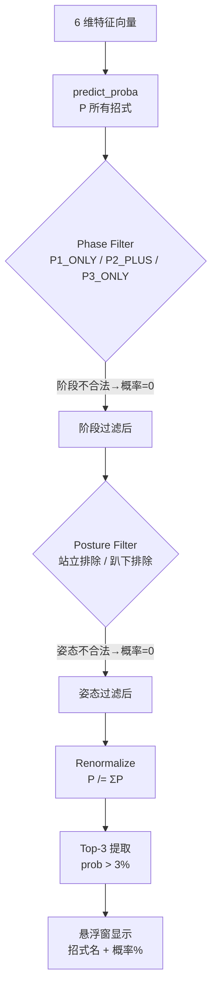

# LightGBM Model

## 概述

BlackDragon 使用 **LightGBM 多分类模型**预测黑龙的下一招攻击。模型以当前战斗状态（6 维特征）为输入，输出每个可能的下一招的预测概率。

## 模型规格

| 属性 | 值 |
|------|-----|
| **框架** | LightGBM 4.6.0 |
| **模型类型** | 多分类（Multiclass） |
| **输入特征数** | 6 |
| **输出类别数** | ~40-60 个招式 |
| **模型文件** | `models/fatalis_ai_model.pkl` (~18 MB) |
| **训练数据来源** | 17 场狩猎记录 → 数千条派生对 |

## 输入特征

| # | 特征 | 类型 | 游戏语义 | 范围 |
|---|------|------|----------|------|
| 0 | `distance` | float | 玩家-怪物 XZ 平面距离 | 0 ~ 5000 |
| 1 | `relative_angle` | float | 玩家相对怪物朝向角 | -180 ~ 180 |
| 2 | `posture` | category(5) | 怪物姿态 | 0/1/2/3/4 |
| 3 | `previous_action` | category(N) | 上一招 Base ID | ≤ 309 |
| 4 | `phase` | category(3) | 战斗阶段 | 1/2/3 |
| 5 | `is_enraged` | category(2) | 发怒状态 | 0/1 |

**特征详情**参见 [[AI_Model/Feature_Engineering|Feature Engineering]]。

## 推理流程

```python
# 1. 构造输入
input_data = pd.DataFrame([{
    'distance': dist,
    'relative_angle': rel_angle,
    'posture': shared_state['posture'],
    'previous_action': action,
    'phase': shared_state['phase'],
    'is_enraged': shared_state['is_enraged']
}])

# 类别特征编码
for col in ['posture', 'previous_action', 'phase', 'is_enraged']:
    input_data[col] = input_data[col].astype('category')

# 2. 模型推理（< 5ms）
probs = model.predict_proba(input_data)[0]   # shape: (n_classes,)
classes = model.classes_                      # shape: (n_classes,)

# 3. 物理规则过滤
probs = filter_probs_by_phase(probs, classes, phase)
probs = filter_probs_by_posture(probs, classes, posture)
probs = renormalize_probs(probs)

# 4. Top-3 提取
top3 = select_top_k(probs, classes, k=3, threshold=0.03)
# [(action_id, probability), ...]
```

## 两层预测架构



> [!important] 核心创新
> 纯 ML 预测会输出物理上不可能的招式（如在 P1 阶段预测 P3 专属招式）。两层架构通过**硬规则过滤**保证输出合法性，这是项目的**核心创新**。

## 推理性能

| 指标 | 值 |
|------|-----|
| 推理触发频率 | 每 0.5s（动作变化时立即触发） |
| 单次推理延迟 | < 5ms |
| UI 刷新频率 | 每帧 ~60fps（AI 结果 0.5s 更新） |
| 模型加载时间 | < 1s（joblib.load 18MB） |

## 模型评估

详见 [[AI_Model/Model_Evaluation|Model Evaluation]]。

| 指标 | 说明 |
|------|------|
| **Accuracy** | 整体准确率（Top-1 命中） |
| **Top-3 命中率** | 真实标签在预测 Top-3 中的比例（实战核心指标） |

> [!note] Top-3 命中率
> 玩家不需要完美精确预测，只需要知道最可能的几招。Top-3 命中率是衡量实用价值的核心指标。

## 模型训练

详见 [[AI_Model/Training_Process|Training Process]]。

```bash
# 训练流程
python data_cleaner.py    # 步骤 1: 清洗数据 → ML_Ready_Dataset.csv
python train_lgbm.py      # 步骤 2: 训练模型 → fatalis_ai_model.pkl
```
