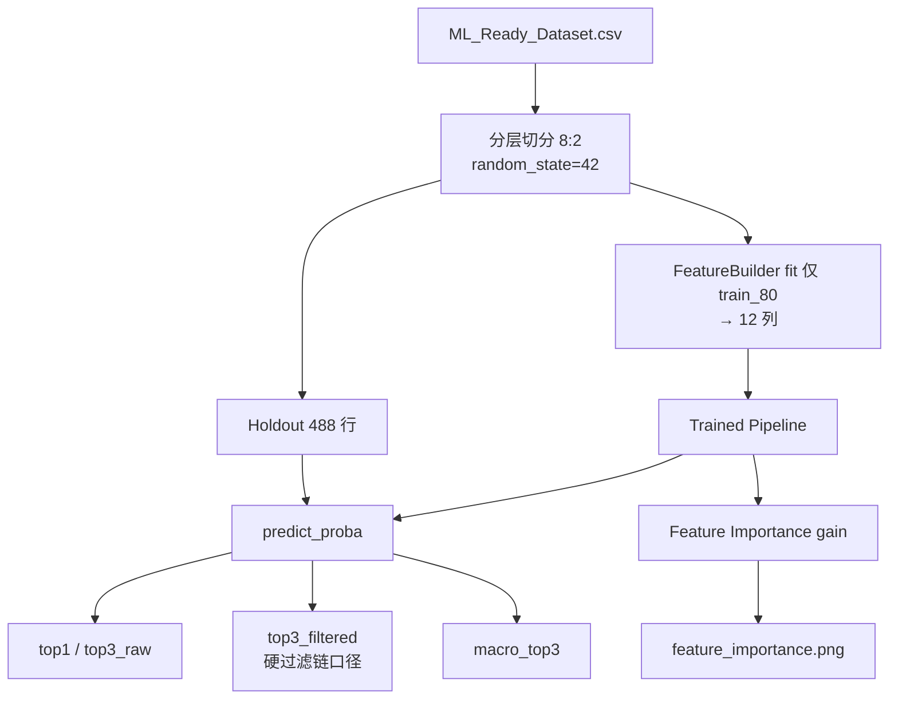

# Model Evaluation

## 概述

BlackDragon 使用四个核心指标评估模型质量（`scripts/benchmark_model.py` 统一口径），并通过特征重要性分析理解模型行为。模型采纳/替换决策另受 G1–G8 门槛矩阵约束（ADR-P6.1）。

## 评估指标（四指标 benchmark）

| 指标 | 含义 | 评估场景 |
|------|------|----------|
| **top1** | Top-1 命中率 | 模型原始质量 |
| **top3_raw** | 真实标签在预测 Top-3 中的比例（未过滤） | 模型原始质量 |
| **top3_filtered** | 逐行以自身 phase/posture 走 ActionPredictor 硬过滤链后的 Top-3 命中 | **实战有效性（核心）** |
| **macro_top3** | 按类平均的 Top-3 命中 | 长尾小类不回退 |

辅助口径（不设门槛，供裁决参考）：`top1_macro` / `macro_top3_filtered`。

> [!important] 实战黄金指标
> top3_filtered 是评估模型实战价值的核心指标。玩家不需要完美精确的单一预测——只要 Top-3 覆盖正确答案，对玩家就有帮助。

## 当前结果（v1.2.0，XGBoost Run B）

留出集口径：488 行 / 46 类（与 v1.1.0 基线同一缓存，可比）。

| 指标 | v1.1.0（LightGBM 基线） | v1.2.0（XGBoost Run B） | Δ |
|------|------------------------|--------------------------|---|
| top1 | 27.05% | **32.58%** | +5.53pp |
| top3_raw | 60.25% | **66.19%** | +5.94pp |
| **top3_filtered（实战口径）** | 58.81% | **65.37%** | +6.56pp |
| macro_top3 | 54.65% | **54.50%** | −0.15pp（无回退） |
| 模型文件 | 19.05 MB | **7.46 MB** | −61% |
| 推理 p95 | 5.35ms | **4.31ms** | 更快 |

历史基线：v0.1.0 top3_raw 56.17%（17 场狩猎）。

## 采纳门槛（G1–G8 摘要）

AutoML 迁移（ADR-P6.1）为候选模型设 8 道门槛，Run B 判定结果：

| ID | 门槛 | 判定线 | Run B 实测 | 判定 |
|----|------|--------|-----------|------|
| G1 | top3_raw | ≥ 基线+3.0pp = 63.25% 采纳 | 66.19% | PASS（采纳区） |
| G2 | top1 | ≥ 基线−1.0pp = 26.05% | 32.58% | PASS |
| G3 | 端到端时延 | p95 ≤ 10.7ms 且 mean ≤ 10ms | 4.31 / 3.97ms | PASS |
| G4 | 模型文件 | ≤ 40MB | 7.46MB | PASS |
| G5 | 内存 | 加载 RSS 增量 ≤ 100MB；稳态 ≤ 316.6MB；5min 漂移 ≤ 5% | 122.0MB / 256.8MB / +0.09% | **G5a 超标→用户 Tier 2 裁决接受**（一次性加载增量；稳态与漂移 PASS） |
| G6 | 发布包体积 | ≤ 300MB | 159.1MB（P7 实测） | PASS |
| G7 | 训练预算 | 单次搜索 wall ≤ 5400s | 5409s | PASS |
| G8 | 可复现 | 导出模型同输入同输出逐位一致 | 逐位一致 | PASS |

G5a 的 122MB 加载增量主体是 xgboost booster 反序列化的固有内存表示，无法从部署侧消除；裁决理由记录于 sidecar `gates.g5a_override_reason`。未来换用不同 booster 结构/树数的模型时需重新评估。

## 特征重要性

```python
# xgboost gain 口径（booster.get_score(importance_type='gain') 归一化）
# 每次训练后自动生成 models/feature_importance.png
```

v1.2.0 实测排序（gain %）：`distance_bin` 14.68 > `posture` 14.58 > `posture_x_phase` 14.08 > `is_enraged` 10.10 > `phase` 9.86 > `prev_action_freq` 7.30 > `distance` 6.54 > `distance_x_enraged` 5.57 > `angle_cos` 5.18 > `previous_action` 4.19 > `relative_angle` 4.01 > `angle_sin` 3.90。**派生特征合计 50.71%**。完整解读见 [[AI_Model/Feature_Engineering|Feature Engineering]] 与 [[docs/AutoML_RunB_Feature_Insights|Run B Feature Insights]]。

## 评估流程



## 评估命令

```bash
# 四指标 benchmark（任意模型文件）
python scripts/benchmark_model.py --model models/fatalis_ai_model.pkl \
    --dataset data/ML_Ready_Dataset.csv
# 输出: top1 / top3_raw / top3_filtered / macro_top3（+辅助口径与时延）

# 训练时自动评估（--pipeline 一键链路内含）
python launch.py --pipeline
```

> [!note] 准确率影响因素
> 1. **训练数据量**：19 场狩猎 2444 行派生对，稀有招式样本仍偏少（靠 auto_augment 增广）
> 2. **特征质量**：12 列（6+6 派生）已消解大部分信息缺口；玩家动作、武器类型仍未采集
> 3. **招式复杂度**：46 类招式池，部分招式高度相似
> 4. **数据分布不均**：常见招式（龙车/火球）样本远多于稀有招式（捕食），macro 口径用于守护长尾

## 改进方向

| 方向 | 预期收益 | 现状 |
|------|----------|------|
| 增加训练数据 | ★★★ | 持续录制（v1.2.0 起一键训练自动合并历史会话） |
| 特征消融实验 | 已完成 | P6 Run A（6 列）vs Run B（12 列）对照 |
| 新增特征（武器类型、玩家动作） | ★★ | 未来扩展 |
| 模型集成 | — | P6 AutoML 已替代手工调参；Run B 单模型已过全部效果门槛 |
