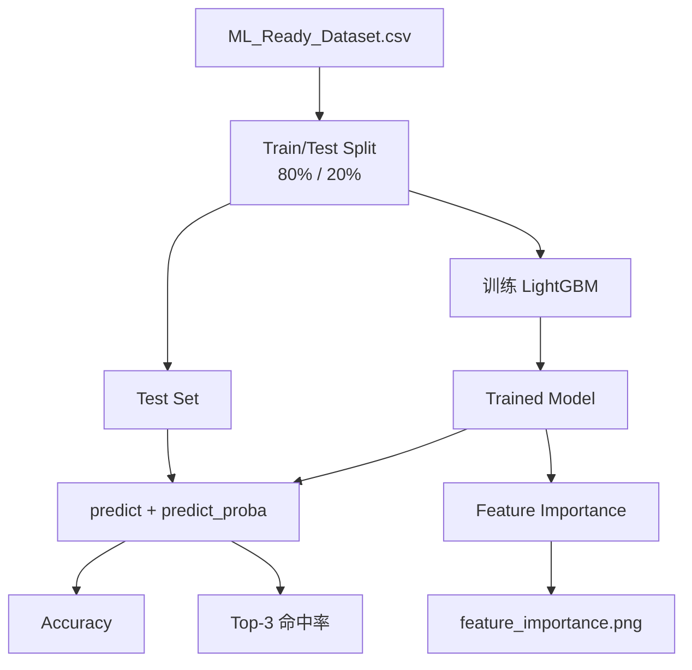

# Model Evaluation

## 概述

BlackDragon 使用两个核心指标评估模型质量，并通过特征重要性分析理解模型行为。

## 评估指标

### 1. Accuracy（绝对准确率）

```python
from sklearn.metrics import accuracy_score
accuracy = accuracy_score(y_test, y_pred)
```

**定义**: 模型预测的 Top-1 招式恰好是怪物实际使用的招式的比例。

**基准（v0.1.0）**: 训练后得到的准确率。随数据积累逐步提升。

### 2. Top-3 命中率（实战核心指标）

```python
probs = model.predict_proba(X_test)
top3_indices = np.argsort(probs, axis=1)[:, -3:]
top3_accuracy = np.mean([
    y_test[i] in model.classes_[top3_indices[i]]
    for i in range(len(y_test))
])
```

**定义**: 真实标签出现在模型预测概率最高的 3 个结果中的比例。

**为什么不只看 Accuracy**:
- 玩家不需要完美精确的单一预测
- Top-3 显示让玩家了解最可能的几招，足够做出反应
- 这是衡量模型**实战价值**的核心指标

**基准（v0.1.0）**: Top-3 命中率 56.17%

### 指标对比

| 指标 | 含义 | 评估场景 |
|------|------|----------|
| Accuracy | 严格正确率（Top-1） | 模型原始质量 |
| Top-3 命中率 | 三选一正确率 | **实战有效性** |

> [!important] 实战黄金指标
> Top-3 命中率是评估模型实战价值的核心指标。即使 Top-1 不准，只要 Top-3 覆盖正确答案，对玩家就有帮助。

## 特征重要性

```python
importance = model.feature_importances_  # importance_type='gain'
```

每次训练后自动生成 `models/feature_importance.png`。

**6 个特征的预期重要性排序**:
1. `previous_action` — 最高（招式连段模式）
2. `phase` — 高（招式池随阶段变化）
3. `posture` — 高（姿态限制可用招式）
4. `distance` — 中（空间距离约束）
5. `relative_angle` — 中（朝向约束）
6. `is_enraged` — 低（行为微调）

## 评估流程



## 评估命令

```bash
python train_lgbm.py
# 自动输出:
#   🏆 绝对准确率 (Accuracy): XX.XX%
#   🌟 实战黄金指标：Top-3 命中率: XX.XX%
```

## 当前结果

| 指标 | 值（v0.1.0 基线） | 说明 |
|------|-------------------|------|
| Accuracy | 见最新训练 | Top-1 命中 |
| Top-3 命中率 | 56.17% | 17 场狩猎训练 |
| 训练样本 | 2447 条 | ML_Ready_Dataset.csv |

> [!note] 准确率影响因素
> 1. **训练数据量**：17 场狩猎可产生数千条派生对，但稀有招式样本不足
> 2. **特征质量**：当前 6 维特征可能遗漏重要信息（如玩家动作、距离变化率）
> 3. **招式复杂度**：黑龙招式池大（~40-60 个），部分招式高度相似
> 4. **数据分布不均**：常见招式（龙车/火球）样本远多于稀有招式（捕食）

## 改进方向

| 方向 | 预期收益 | 计划 |
|------|----------|------|
| 增加训练数据 | ★★★ | 持续录制 |
| 增量学习 | ★★ | P5: LightGBM `init_model` |
| 特征消融实验 | ★ | P5: 评估每个特征的贡献 |
| 新增特征（武器类型、玩家动作） | ★★ | 未来扩展 |
| 模型集成 | ★ | P5 评估 |
