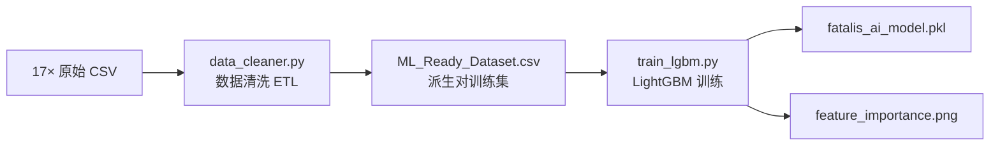

# Training Pipeline — BlackDragon v1.0

> 完整训练管线（合并旧 AI_Pipeline + Training_Process 的概览版）。详细超参数见原 [[AI_Model/Training_Process|Training Process]]。

## 1. 管线图



## 2. 数据采集

| 属性 | 值 |
|------|-----|
| 触发条件 | 进入虚黑城（zone == 417）且录制开启 |
| 频率 | 每 0.1s 一行 |
| 采集者 | `CombatRecorder`（daemon 线程） |
| 积累 | 17+ 个文件，~11 MB |
| 列 | timestamp, hp_percent, phase, is_enraged, distance, relative_angle, posture, action_id |

> 双进程架构下，Dashboard 与 Overlay 各自有独立 Recorder，各自写独立 CSV 文件。

## 3. 数据清洗（data_cleaner.py）

关键操作：

1. **过滤**：`distance >= 5000` 丢弃；`action_id == 1` 丢弃
2. **动作合并映射**：`ACTION_MAPPING` 将动画帧 ID 合并为 Base ID（如 38,39,40 → 37），共 54 条
3. **姿态状态机**：跨招式追踪姿态变化（站立/趴下/飞行/倒地/演出）
4. **派生对提取**：仅动作切换时记录 `(状态, 上一招) → 下一招`
5. **排除**：`MINOR_AND_PASSIVE ∪ SCRIPTED_IDS`（小动作/演出/倒地不作为 label）

**输出**：`data/ML_Ready_Dataset.csv`（7 列：distance, relative_angle, posture, previous_action, phase, is_enraged, next_action）

## 4. 模型训练（train_lgbm.py）

### 超参数

| 参数 | 值 | 作用 |
|------|-----|------|
| objective | multiclass | 多分类 |
| num_leaves | 63 | 叶节点数 |
| max_depth | 7 | 最大深度 |
| learning_rate | 0.03 | 学习率 |
| n_estimators | 300 | 最大树数（early_stopping=15 实际更少） |
| class_weight | balanced | 稀有招式自动平衡 |
| subsample | 0.8 | 行采样 |
| colsample_bytree | 0.8 | 列采样（6 取 5） |
| random_state | 42 | 可复现 |
| importance_type | gain | 特征重要性 |

### 训练数据

| 指标 | 数值 |
|------|------|
| 清洗后样本 | 数千条派生对 |
| 招式类别数 | ~40-60 个 |
| 每类最少样本 | ≥3（过滤后） |
| Train/Test | 80% / 20% |

### 命令

```bash
python data_cleaner.py   # → ML_Ready_Dataset.csv
python train_lgbm.py     # → fatalis_ai_model.pkl + feature_importance.png
```

## 5. 评估指标

| 指标 | 计算方式 | 说明 |
|------|----------|------|
| Accuracy | `accuracy_score(y_test, y_pred)` | Top-1 命中率 |
| Top-3 命中率 | 真实标签在 Top-3 概率中的比例 | **实战核心指标**（v0.1.0 基线 56.17%） |

## 6. 训练产物

| 文件 | 大小 | 说明 |
|------|------|------|
| `models/fatalis_ai_model.pkl` | ~18 MB | joblib 序列化 LightGBM 模型 |
| `models/feature_importance.png` | ~50 KB | 6 特征重要性条形图 |

## 7. 技术债与改进方向

| # | 问题 | 计划 |
|---|------|------|
| #6 | 无模型版本管理 | P6: 文件名加时间戳 + metadata.json |
| #7 | 无增量学习 | P6: LightGBM `init_model` |
| #8 | 无数据 schema version | P6: CSV 引入 `schema_version` 列 |
| #9 | 缺少特征消融实验 | P6: 逐特征移除对比 |
