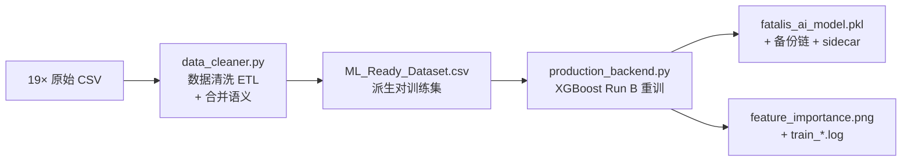

# Training Pipeline — BlackDragon v1.2

> 完整训练管线（合并旧 AI_Pipeline + Training_Process 的概览版）。详细超参数与复现要点见 [[AI_Model/Training_Process|Training Process]]。

## 1. 管线图



**入口分工**（ADR-P6.1 Decision 4）：

| 入口 | 链路 | 状态 |
|------|------|------|
| `launch.py --pipeline`（Dashboard 训练按钮） | data_cleaner（合并语义）→ `src/model/production_backend.py`（Run B 配置） | **推荐（v1.2.0）** |
| `launch.py --train` / `python train_lgbm.py` | data_cleaner 产物 → LightGBM 旧管线 | legacy（向后兼容保留） |

## 2. 数据采集

| 属性 | 值 |
|------|-----|
| 触发条件 | 进入虚黑城（zone == 417）且录制开启 |
| 频率 | 每 0.1s 一行 |
| 采集者 | `CombatRecorder`（daemon 线程） |
| 积累 | 19 个出厂文件（~11 MB），随发行包分发作重建保险 |
| 列 | timestamp, hp_percent, phase, is_enraged, distance, relative_angle, posture, action_id |

> 双进程架构下，Dashboard 与 Overlay 各自有独立 Recorder，各自写独立 CSV 文件。

## 3. 数据清洗（data_cleaner.py）

关键操作：

1. **合并语义**（v1.2.0）：重建数据集时，现有 `ML_Ready_Dataset.csv` 中 `source_session` 不在磁盘 CSV 集合内的行**保留**，在场会话重新提取后追加——录 1 场新战斗不再静默替换出厂 19 会话数据集；全量 CSV 在场时输出与工厂数据集逐字节一致
2. **过滤**：`distance >= 5000` 丢弃；`action_id == 1` 丢弃
3. **动作合并映射**：`ACTION_MAPPING` 将动画帧 ID 合并为 Base ID（如 38,39,40 → 37），共 54 条
4. **姿态状态机**：跨招式追踪姿态变化（站立/趴下/飞行/倒地/演出）
5. **派生对提取**：仅动作切换时记录 `(状态, 上一招) → 下一招`
6. **排除**：`MINOR_AND_PASSIVE ∪ SCRIPTED_IDS`（小动作/演出/倒地不作为 label）

**输出**：`data/ML_Ready_Dataset.csv`（8 列：distance, relative_angle, posture, previous_action, phase, is_enraged, next_action + source_session）

## 4. 模型训练（src/model/production_backend.py）

### 超参数（Run B，FLAML AutoML 搜索产物）

| 参数 | 值 | 作用 |
|------|-----|------|
| n_estimators | 190 | 树数 |
| max_depth / max_leaves | 4 / 4 | 浅树防过拟合 |
| learning_rate | 0.078 | 学习率 |
| subsample | 0.946 | 行采样 |
| n_jobs | 1 | 单线程（训练与推理均无 CPU 尖峰） |
| FeatureBuilder fit | 仅 train_80 | 派生特征防泄漏红线 |

训练链路细节（auto_augment 镜像 / shuffle / LabelEncoder / Pipeline 组装 / 原子提升）见 [[AI_Model/Training_Process|Training Process]]。

### 训练数据

| 指标 | 数值 |
|------|------|
| 清洗后样本 | 2444 行派生对（19 会话） |
| 留出集 | 488 行 / 46 类 |
| Train/Test | 80% / 20%（分层，random_state=42） |

### 命令

```bash
python launch.py --pipeline   # 一键: data_cleaner（合并语义）→ production_backend（Run B）
python launch.py --train      # legacy: LightGBM 旧管线（向后兼容）
```

## 5. 评估指标

| 指标 | 计算方式 | v1.2.0 留出集 |
|------|----------|------|
| Top-1 | 预测第一位命中 | 32.58% |
| Top-3（raw） | 真实标签在 Top-3 概率中的比例 | **66.19%**（v0.1.0 基线 56.17% → v1.1.0 60.25% → v1.2.0 66.19%） |
| Top-3（filtered） | 阶段+姿态硬过滤后（实战口径） | **65.37%** |

四指标 benchmark 工具见 [[AI_Model/Model_Evaluation|Model Evaluation]]（`scripts/benchmark_model.py`）。

## 6. 训练产物

| 文件 | 大小 | 说明 |
|------|------|------|
| `models/fatalis_ai_model.pkl` | 7.46 MB | joblib 序列化 XGBoost Pipeline |
| `models/fatalis_ai_model.pkl.meta.json` | ~2 KB | sidecar（来源链 / sha / 门槛 / gate_warnings） |
| `models/feature_importance.png` | ~50 KB | 12 特征 gain 重要性条形图 |
| `models/train_*.log` | — | 训练日志（保留 10 份） |
| `models/fatalis_ai_model.pkl.bak` / `.bak2` | — | 两代备份链（同 sha 跳过轮换） |
| `models/factory_model.pkl` | 7.46 MB | 出厂不可变回滚副本 |

## 7. 技术债与改进方向

| # | 问题 | 现状 |
|---|------|------|
| #6 | 无模型版本管理 | 已基本解决（v1.2.0）：sidecar + 备份链 + factory model |
| #7 | 无增量学习 | 未做（全量重训几秒完成，动机减弱） |
| #8 | 无数据 schema version | 远古格式（无 source_session 列）不合并，告警并留在备份链 |
| #9 | 缺少特征消融实验 | 已做（P6 Run A/B 对照） |
