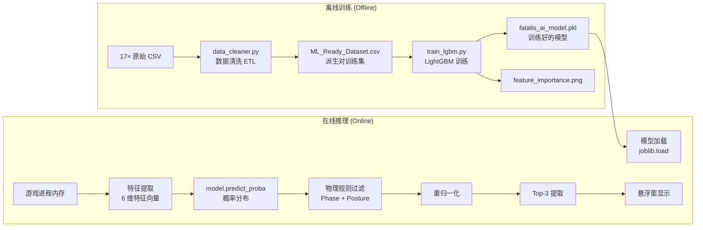
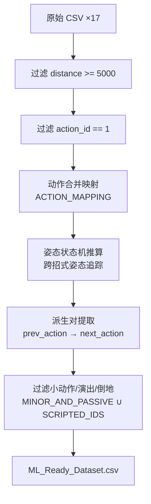
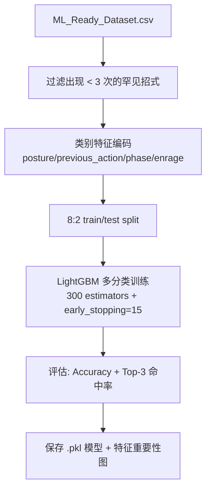

# AI Pipeline

## 概述

BlackDragon 的机器学习管线分为 **离线训练** 和 **在线推理** 两个阶段，中间通过 `.pkl` 模型文件连接。

## Step 1: 数据采集

| 属性 | 值 |
|------|-----|
| **触发条件** | 进入虚黑城（zone == 417）自动开始 |
| **频率** | 每 0.1s 一行 |
| **积累** | 17 个文件，~11 MB |
| **列** | timestamp, hp_percent, phase, is_enraged, distance, relative_angle, posture, action_id |

> [!note] 录制线程
> `data_logger_thread()` 作为 daemon 线程运行，与 UI 渲染线程并行。

## Step 2: 数据清洗（data_cleaner.py）

**关键操作**:
1. **动作合并映射**: 38,39,40 → 37（龙车动画帧→起手式），共 54 条映射
2. **姿态状态机**: 追踪跨招式的姿态变化（站立/趴下/飞行/倒地/演出）
3. **派生对提取**: 仅在动作切换时记录 (状态, 上一招) → 下一招

## Step 3: 模型训练（train_lgbm.py）

**超参数**:

| 参数 | 值 | 说明 |
|------|-----|------|
| num_leaves | 63 | 叶节点数 |
| max_depth | 7 | 最大树深度 |
| learning_rate | 0.03 | 学习率 |
| n_estimators | 300 | 最大树数（配合 early_stopping） |
| subsample | 0.8 | 行采样率 |
| colsample_bytree | 0.8 | 列采样率 |
| class_weight | balanced | 自动平衡稀有/常见招式权重 |

## Step 4: 在线推理

参见 [[Architecture/System_Architecture#4-ai-推理层|AI 推理层]] 和 [[AI_Model/LightGBM_Model|LightGBM 模型文档]]。

**两层预测架构**:
1. **ML 层**: `predict_proba()` → 所有招式概率分布
2. **物理规则层**: Phase 过滤 → Posture 过滤 → 重归一化 → Top-3

## Step 5: 数据升级（data_upgrade.py）

对于缺少 `phase` 和 `is_enraged` 列的旧版 CSV：
- **Phase 回填**: `hp_percent` → 推算阶段（≤78%=P2, ≤50%=P3）
- **Enrage 回溯**: 怒吼动作（4,5,179）+180s 软计时器推算发怒区间

> [!warning] 数据版本管理
> 当前无 schema version 标识（技术债 #8）。data_upgrade.py 通过试探列名判断格式。P5 计划引入 `schema_version` 列。
