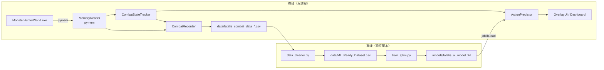
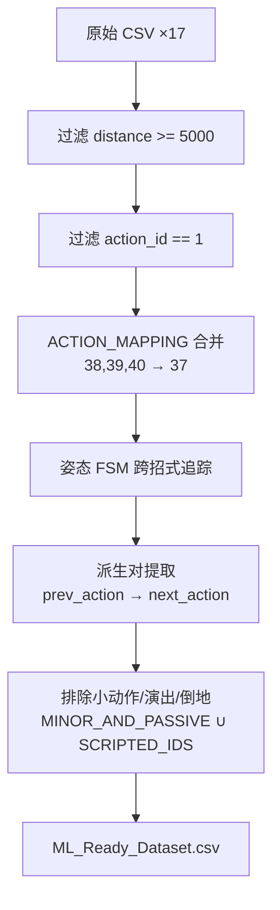

# Data Flow — BlackDragon v1.0

> 数据全链路：游戏内存 → 录制 → 清洗 → 训练 → 推理（合并旧 AI_Pipeline + Data_Flow）。

## 1. 全链路图



## 2. 在线路径：推理

```
Game RAM (raw bytes)
  → MemoryReader.read_* (Python float/int)
  → CombatStateTracker (派生状态: phase/enrage/posture/nova)
  → ActionPredictor.predict(6 features)
  → [(class_id, prob), ...]
  → OverlayUI._compute_ai_display (格式化文本)
  → DPG set_value (显示)
```

**数据格式转换**：
| 阶段 | 数据 | 说明 |
|------|------|------|
| pymem 读取 | `pm.read_float/int/longlong` | raw bytes → Python 数值 |
| 状态计算 | `calc_distance_2d` / `calc_relative_angle` | 坐标 → 特征 |
| 推理 | `predict_proba` → filter → renormalize → top-k | 概率数组 → Top-3 |
| 显示 | `ACTION_DB.get(id)` | ID → 中文招式名 |

## 3. 在线路径：录制

**CSV 列**（8 列，`CombatRecorder._COLUMNS` 单源）：

| 列名 | 类型 | 说明 |
|------|------|------|
| timestamp | float | Unix 时间戳 |
| hp_percent | float | HP 百分比 (0-1) |
| phase | int | 阶段 (1/2/3) |
| is_enraged | int | 发怒 (0/1) |
| distance | float | XZ 距离 |
| relative_angle | float | 相对角度 |
| posture | int | 姿态 (0-4) |
| action_id | int | 原始动作 ID |

**文件命名**：`data/fatalis_combat_data_YYYYMMDD_HHMMSS.csv`

**门控**：`is_recording == True` 且 `zone == 417`（虚黑城）。帧间隔 0.1s。

**注意**：双进程各自有独立 Recorder，各自写独立 CSV 文件（P5.3 设计）。

## 4. 离线路径：清洗（data_cleaner.py）



**输出列**（7 列）：`distance, relative_angle, posture, previous_action, phase, is_enraged, next_action`（标签）

## 5. 离线路径：训练（train_lgbm.py）

```
ML_Ready_Dataset.csv
  → 过滤出现 < 3 次的罕见招式
  → 类别特征编码（posture/previous_action/phase/enrage → category）
  → 8:2 train/test split (random_state=42)
  → LightGBM 多分类（300 estimators, early_stopping=15）
  → 评估（Accuracy + Top-3 命中率）
  → models/fatalis_ai_model.pkl + feature_importance.png
```

详见 [[AI_Model/Training_Pipeline|Training Pipeline]]。

## 6. 配置数据流

```
blackdragon_config.json
  ├── AppConfig.load()  ← Dashboard 进程（launch.py）
  └── AppConfig.load()  ← Overlay 进程（overlay.py）
       ↓
       AppConfig.save() ← Dashboard 进程（设置变更时）
```

**跨进程共享模式**：两个进程在启动时**各自独立**加载同一份 `blackdragon_config.json`。运行时修改配置不会同步到已运行的另一个进程——需要重启生效。`auto_start_overlay` / `auto_record` 在各自启动时生效。

`AppConfig.save()` 已定义但当前运行时未主动调用（保留用于未来 Dashboard 设置面板持久化用户偏好）。

## 7. 数据版本管理（技术债）

- 当前 CSV 无 `schema_version` 列
- `data_upgrade.py` 通过试探列名判断旧格式，为旧 CSV 回填 `phase` / `is_enraged`
- P6 计划引入 schema versioning
