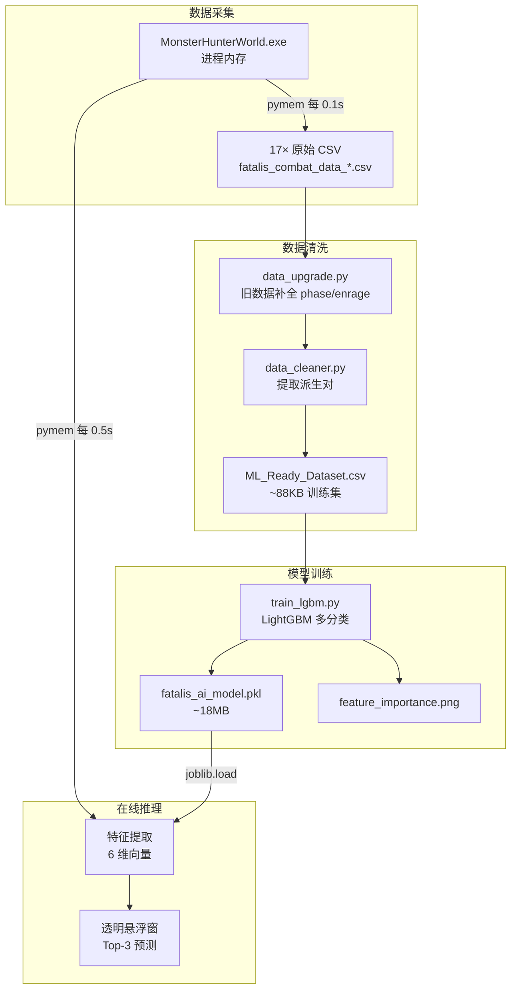

# Data Flow

## 概述

BlackDragon 的数据流从游戏内存开始，经过采集→清洗→训练→推理的完整链路。



## 原始数据格式

### fatalis_combat_data_*.csv（录制输出）

| 列名 | 类型 | 说明 | 示例值 |
|------|------|------|--------|
| timestamp | float | Unix 时间戳 | 1716543200.123 |
| hp_percent | float | HP 百分比 (0-1) | 0.85 |
| phase | int | 战斗阶段 (1/2/3) | 1 |
| is_enraged | int | 发怒状态 (0/1) | 0 |
| distance | float | 玩家-怪物 XZ 距离 | 850.3 |
| relative_angle | float | 相对角度 (-180~180) | -45.2 |
| posture | int | 怪物姿态 (0-4) | 1 |
| action_id | int | 原始动作 ID（动画帧） | 38 |

**产生方式**: `data_logger_thread()` 每 0.1s 写入一行。仅在 zone==417（虚黑城）时工作。

### 旧版数据问题

部分历史 CSV 缺少 `phase` 和 `is_enraged` 列。通过 `data_upgrade.py` 补全：
- Phase 从 `hp_percent` 回填
- Enrage 从怒吼动作 +180s 软计时器回溯

## 清洗后数据格式

### ML_Ready_Dataset.csv（训练集）

| 列名 | 类型 | 说明 |
|------|------|------|
| distance | float | 玩家-怪物 XZ 距离 |
| relative_angle | float | 相对角度 |
| posture | int | 怪物姿态 (0-4) |
| previous_action | int | 上一招 Base ID（合并后） |
| phase | int | 战斗阶段 (1/2/3) |
| is_enraged | int | 发怒状态 (0/1) |
| **next_action** | int | **标签**：下一招 Base ID |

**样本量**: 数千条派生对（17 次狩猎）

## 数据变换关键节点

| 节点 | 输入 | 输出 | 变换逻辑 |
|------|------|------|----------|
| **动作合并** | raw_action_id (动画帧) | base_action_id (起手式) | `ACTION_MAPPING` 查表 |
| **姿态追踪** | action_id 序列 | posture ∈ {0,1,2,3,4} | 状态机：特定招式触发切换 |
| **派生提取** | 逐帧 CSV | (状态, 上一招) → 下一招 | 仅 action 切换时记录，排除无效招式 |
| **物理过滤** | ML 概率 + phase/posture | 过滤后概率 | 不合法招式概率归零 |
| **发怒检测** | 怪物内存 +0x1BE30 | is_enraged ∈ {0,1} | 0 < timer < max |

## 数据目录结构

```
data/
├── fatalis_combat_data_20260426_084938.csv  # 第 1 场
├── fatalis_combat_data_20260426_091945.csv  # 第 2 场
├── ...
├── fatalis_combat_data_20260707_223118.csv  # 第 17 场
└── ML_Ready_Dataset.csv                     # 清洗后的训练集（全量合并）
```

> [!warning] 数据版本管理（技术债 #8）
> 当前 CSV 无 schema version 标识，`data_upgrade.py` 通过试探列名判断格式。P5 计划引入 `schema_version` 列，实现自动化版本迁移。
