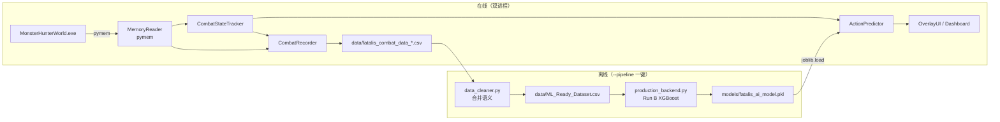
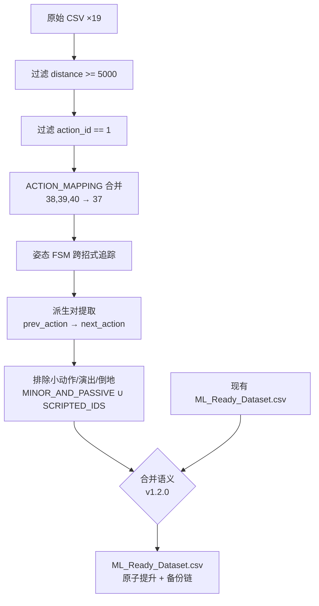

# Data Flow — BlackDragon v1.2

> 数据全链路：游戏内存 → 录制 → 清洗 → 训练 → 推理（合并旧 AI_Pipeline + Data_Flow）。

## 1. 全链路图



## 2. 在线路径：推理

```
Game RAM (raw bytes)
  → MemoryReader.read_* (Python float/int)
  → CombatStateTracker (派生状态: phase/enrage/posture/nova)
  → ActionPredictor.predict(6 features)
  → Pipeline 内 FeatureBuilder 扩展 12 列 → predict_proba
  → [(class_id, prob), ...]
  → OverlayUI._compute_ai_display (格式化文本)
  → DPG set_value (显示)
```

**数据格式转换**：
| 阶段 | 数据 | 说明 |
|------|------|------|
| pymem 读取 | `pm.read_float/int/longlong` | raw bytes → Python 数值 |
| 状态计算 | `calc_distance_2d` / `calc_relative_angle` | 坐标 → 特征 |
| 推理 | `predict_proba` → filter → renormalize → top-k | 概率数组 → Top-3 |
| 显示 | `ACTION_DB.get(id)` | ID → 中文招式名 |

## 3. 在线路径：录制

**CSV 列**（8 列，`CombatRecorder._COLUMNS` 单源）：

| 列名 | 类型 | 说明 |
|------|------|------|
| timestamp | float | Unix 时间戳 |
| hp_percent | float | HP 百分比 (0-1) |
| phase | int | 阶段 (1/2/3) |
| is_enraged | int | 发怒 (0/1) |
| distance | float | XZ 距离 |
| relative_angle | float | 相对角度 |
| posture | int | 姿态 (0-4) |
| action_id | int | 原始动作 ID |

**文件命名**：`data/fatalis_combat_data_YYYYMMDD_HHMMSS.csv`

**门控**：`is_recording == True` 且 `zone == 417`（虚黑城）。帧间隔 0.1s。

**注意**：双进程各自有独立 Recorder，各自写独立 CSV 文件（P5.3 设计）。

## 4. 离线路径：清洗（data_cleaner.py，合并语义）



**合并语义**（ADR-P6.1 Decision 5，v1.2.0）：重建数据集时，现有数据集中 `source_session` 不在磁盘 CSV 集合内的行**保留**（历史会话不丢），在场会话重新提取后追加；全量 CSV 在场时输出与工厂数据集**逐字节一致**。远古格式（无 `source_session` 列）不合并，告警并留在备份链。

**输出列**（8 列）：`distance, relative_angle, posture, previous_action, phase, is_enraged, next_action（标签）, source_session`

## 5. 离线路径：训练（src/model/production_backend.py）

```
ML_Ready_Dataset.csv
  → load_ml_dataset → 分层切分 8:2 (random_state=42)
  → FeatureBuilder 仅 fit 于 train_80（防泄漏）→ 12 列
  → 稀有类 auto_augment 镜像（<20 样本类整行复制，1949→2175 行）
  → shuffle(random_state=1) → LabelEncoder
  → XGBClassifier（Run B 配置：190 树 / depth 4 / lr 0.078 / n_jobs=1）
  → LabelDecodedEstimator 包装 → sklearn Pipeline
  → 写 .tmp → promote_with_backup 原子提升（两代备份链）
  → fatalis_ai_model.pkl + feature_importance.png + sidecar meta.json
```

**训练守门与可观测**：训练前打印数据摘要行（📊 本次 vs 上代的 会话/行/类）；破坏性变化（行数 < 上代 50%、holdout < 100 行、类数降 ≥20%）打 ⚠ 警告（只警告不阻塞，写 sidecar `gate_warnings`）；输出 tee 到 `models/train_*.log`（保留 10 份）。

详见 [[AI_Model/Training_Pipeline|Training Pipeline]]。

## 6. 模型与数据集备份链（v1.2.0）

`src/core/backup_chain.py` 的 `promote_with_backup(tmp, target, generations=2)` 为模型与数据集两侧共用：

```
factory_model.pkl     ← 出厂不可变副本（随包分发，训练/轮换永不触碰；终极回滚层）
fatalis_ai_model.pkl  ← 当前生产模型
fatalis_ai_model.pkl.bak   ← 上一代
fatalis_ai_model.pkl.bak2  ← 上上代
（数据集 ML_Ready_Dataset.csv 同理；内容不变时 same-sha 跳过轮换）
```

回滚层级（用户视角）：`factory_model.pkl`（任意时刻）→ `.bak` → `.bak2`；数据集也可删除后从随包 19 个原始 CSV 逐字节重建。

## 7. 配置数据流

```
blackdragon_config.json
  ├── AppConfig.load()  ← Dashboard 进程（launch.py）
  └── AppConfig.load()  ← Overlay 进程（overlay.py）
       ↓
       AppConfig.save() ← Dashboard 进程（设置变更时）
```

**跨进程共享模式**：两个进程在启动时**各自独立**加载同一份 `blackdragon_config.json`。运行时修改配置不会同步到已运行的另一个进程——需要重启生效。`auto_start_overlay` / `auto_record` 在各自启动时生效。

`AppConfig.save()` 已定义但当前运行时未主动调用（保留用于未来 Dashboard 设置面板持久化用户偏好）。

## 8. 数据版本管理（技术债）

- CSV 无 `schema_version` 列；v1.2.0 合并语义以 `source_session` 列为界：缺失该列的远古格式不合并、告警并留在备份链
- 出厂 19 个原始 CSV 随发行包分发，作为数据集从零逐字节重建的保险
