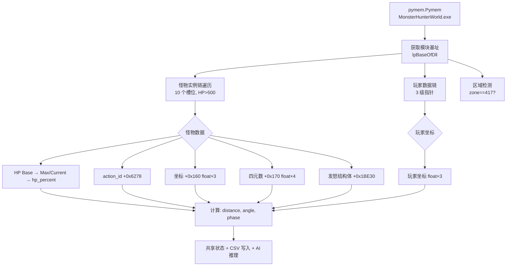

# Memory Architecture

## 概述

BlackDragon 通过 `pymem` 直接读取 `MonsterHunterWorld.exe` 的进程内存，获取玩家坐标、怪物状态、战斗数据等实时信息。

## 内存读取流程



## 指针链

### 怪物实例链

```
[Monster Base + 0x051238C8]
    → +0x698 → [First MonPtr]
    → +i*0x8 → [Slot i MonPtr]
    → +0x138 → [Next Ptr]
    → [0] → Final Monster Instance

遍历 0 ≤ i < 10，找到 HP > 500 的实例 = 黑龙
```

### 玩家数据链

```
[Player Base + 0x050139A0]
    → +0x50 → [Ptr1]
    → +0xC0 → [Ptr2]
    → +0x670 → Player XYZ (float×3)
```

### 怪物数据布局

```
Monster Instance (ptr)
    ├── +0x160: Monster XYZ (float×3)
    ├── +0x170: Monster Quaternion (float×4, wxyz)
    ├── +0x6278: Action ID (int32)
    ├── +0x7670: HP Pointer → +0x60 (HP Max, float)
    │                         +0x64 (HP Current, float)
    └── +0x1BE30: Enrage Struct → +0x24 (Timer, float)
                                  +0x28 (Max, float)
```

### 区域检测

```
[Zone Base + 0x0500ECA0]
    → +0xAED0 → Zone ID (int32)
    417 = 虚黑城 (Fatalis Arena)
```

## GameOffsets 数据类

所有偏移量集中在 `src/config/offsets.py`，使用 `frozen=True` dataclass：

```python
@dataclass(frozen=True)
class GameOffsets:
    # 基址（模块内偏移量）
    PLAYER_BASE: int  = 0x050139A0
    MONSTER_BASE: int = 0x051238C8
    ZONE_BASE: int    = 0x0500ECA0

    # 怪物实例链
    MONSTER_LIST_FIRST: int    = 0x698
    MONSTER_LIST_STRIDE: int   = 0x8
    MONSTER_LIST_NEXT: int     = 0x138
    MONSTER_LIST_TERMINAL: int = 0

    # 怪物属性
    MONSTER_HP_BASE: int    = 0x7670
    HP_MAX: int             = 0x60
    HP_CURRENT: int         = 0x64
    MONSTER_COORDS: int     = 0x160
    MONSTER_QUAT: int       = 0x170
    MONSTER_ACTION_ID: int  = 0x6278

    # 发怒结构体
    ENRAGE_STRUCT: int = 0x1BE30
    ENRAGE_TIMER: int  = 0x24
    ENRAGE_MAX: int    = 0x28

    # 玩家链
    PLAYER_CHAIN_1: int = 0x50
    PLAYER_CHAIN_2: int = 0xC0
    PLAYER_COORDS: int  = 0x670

    # 区域
    ZONE_OFFSET: int  = 0xAED0
    ZONE_FATALIS: int = 417

    # 战斗参数
    MONSTER_MAX_SLOTS: int = 10
    MONSTER_MIN_HP: float  = 500.0
```

**共 23 个字段**，详见 [[Game_Reverse/Offset_System|Offset System]]。

## 内存读取函数

### get_ptr(pm, base, offsets)
多级指针解引用工具函数：
```
addr = pm.read_longlong(base)
for o in offsets[:-1]:
    addr = pm.read_longlong(addr + o)
return addr + offsets[-1]
```

### find_monster(pm, base)
遍历 10 个怪物槽位，返回 HP > 500 的实例指针：
- 遍历 `MONSTER_LIST_FIRST → [i*8] → +0x138 → [0]`
- 对每个实例读取 HP，大于 500 即为黑龙
- 找不到返回 0

### 坐标与角度计算

```python
# XZ 平面距离（忽略 Y 轴高度）
distance = √((p_x - m_x)² + (p_z - m_z)²)

# 怪物朝向 → 玩家方位 的相对角度
monster_yaw = atan2(2*(wz + xy), 1 - 2*(w² + x²))  # 从四元数提取
target_yaw = atan2(p_x - m_x, p_z - m_z)           # 位置差方位角
rel_angle = (target_yaw - monster_yaw + 180) % 360 - 180  # 归一化 [-180,180]
```

## 辅助工具

### enrage.py — 发怒结构体扫描器

独立诊断工具，不参与主流程。实时打印 +0x1BE30 起始的 11 个 float 值，辅助发现发怒计时器字段。

```bash
python enrage.py  # 需要游戏运行中
```

扫描偏移: `[0x00, 0x04, 0x08, 0x0C, 0x10, 0x14, 0x18, 0x1C, 0x20, 0x24, 0x28]`

### 游戏更新后的修改指南

参见 [[../docs/offsets_guide|Offsets Guide]]。

> [!warning] 版本依赖性
> 所有偏移量针对**特定 MHW PC 版本**。游戏更新后基址和部分偏移量可能失效。使用 Cheat Engine 重新定位，更新 `src/config/offsets.py` 即可——业务逻辑代码无需修改。
