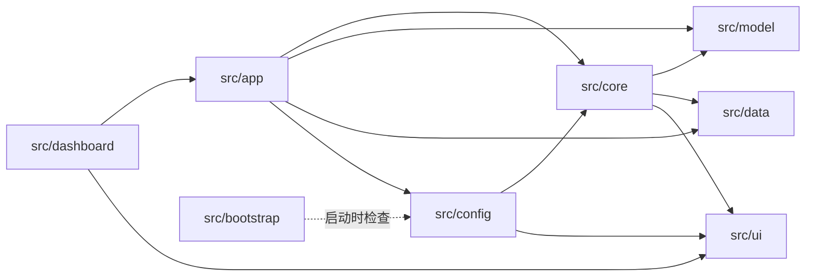

# Module Design — BlackDragon v1.0

> 本文档描述 `src/` 下所有模块的职责、关键 API 与测试映射。基于当前源码（P5.3 auto-start）。

## 1. src/ 目录树

```
src/
├── __init__.py
├── logging_config.py          # 统一日志（setup_logging + QueueHandler）
│
├── core/                      # P4 — 纯逻辑核心
│   ├── state_tracker.py       #   CombatStateTracker（战斗状态 FSM）
│   └── memory_reader.py       #   MemoryReader（pymem 内存读取）
│
├── model/                     # P4 — AI 模型
│   └── predictor.py           #   ActionPredictor（加载 + 推理）
│
├── data/                      # P4 — 数据采集
│   └── recorder.py            #   CombatRecorder（CSV 录制 daemon）
│
├── ui/                        # P4.5 + P5.1 — UI
│   ├── overlay.py             #   OverlayUI（透明覆盖层，独立进程）
│   └── fonts.py               #   setup_cjk_font（共享中文字体）
│
├── app/                       # P5 — 应用协调
│   ├── config.py              #   AppConfig（JSON 持久化）
│   ├── controller.py          #   AppController（生命周期协调）
│   └── game_service.py        #   GameService（后台游戏检测）
│
├── dashboard/                 # P5 — 控制中心 UI
│   ├── main_window.py         #   Dashboard（主窗口 + Tabs）
│   ├── status_bar.py          #   StatusBar（状态指示灯）
│   ├── log_view.py            #   LogView（实时日志）
│   └── training_panel.py      #   TrainingPanel（训练控制）
│
├── bootstrap/                 # P5.1 — 启动检查
│   └── checker.py             #   DependencyChecker（环境检查）
│
└── config/                    # P2 — 唯一数据源
    ├── actions.py             #   ACTION_DB / ACTION_MAPPING / 分类集合
    └── offsets.py             #   GameOffsets（内存偏移量）
```

## 2. 模块职责卡片

### 2.1 `src/core/state_tracker.py` — CombatStateTracker

**职责**：纯战斗状态管理。从原始内存数据计算派生状态（phase / enrage / posture / nova），替代原 `shared_state` dict。

**关键 API**：

| 方法 | 签名 | 说明 |
|------|------|------|
| `calc_distance_2d` | `(p_coords, m_coords) -> float` | XZ 平面距离 |
| `calc_relative_angle` | `(p_coords, m_coords, m_quat) -> float` | 相对角度 [-180,180] |
| `map_action` | `(raw_action: int) -> int` | 动画帧 ID → Base ID |
| `update_phase` | `(hp_percent) -> None` | HP% → P1/P2/P3 |
| `update_enrage` | `(enrage_timer, enrage_max) -> None` | 发怒状态 |
| `update_posture` | `(action) -> int \| None` | 姿态 FSM 切换 |
| `update_nova` | `(hp_percent, action) -> bool` | Nova 阈值预警 |
| `reset_for_zone_change` | `() -> None` | 离开虚黑城时重置 |

**零依赖**：仅 `math` + `src.config.actions`。

### 2.2 `src/core/memory_reader.py` — MemoryReader

**职责**：所有 pymem 进程内存读取的唯一入口。无业务逻辑，返回原始数据。

**关键 API**：

| 方法 | 签名 | 说明 |
|------|------|------|
| `follow_pointer_chain` | `(address, offsets) -> int` | 多级指针解引用 |
| `check_zone` | `() -> int \| None` | 区域 ID（无 417 判断） |
| `find_monster` | `() -> int \| None` | 遍历 10 槽位找黑龙 |
| `read_player_coords` | `() -> list[float] \| None` | 玩家坐标 |
| `read_monster_coords` | `(monster_ptr) -> list[float] \| None` | 怪物坐标 |
| `read_monster_quat` | `(monster_ptr) -> list[float] \| None` | 怪物四元数 |
| `read_monster_hp` | `(monster_ptr) -> float \| None` | HP 百分比 |
| `read_monster_action` | `(monster_ptr) -> int \| None` | 动作 ID |
| `read_enrage_state` | `(monster_ptr) -> tuple[float, float]` | 发怒计时器/上限 |

**依赖**：`pymem` + `src.config.offsets`。

### 2.3 `src/model/predictor.py` — ActionPredictor

**职责**：模型加载 + 推理管线。加载失败 → `_model = None` → `predict()` 返回 `[]`。

**关键 API**：

| 方法 | 签名 | 说明 |
|------|------|------|
| `predict` | `(distance, relative_angle, posture, previous_action, phase, is_enraged) -> list[tuple[int, float]]` | 6 特征推理 |
| `filter_probs_by_phase` | static | 阶段过滤 |
| `filter_probs_by_posture` | static | 姿态过滤 |
| `renormalize_probs` | static | 重归一化 |
| `select_top_k` | static | Top-3 提取（threshold=0.03） |

**属性**：`is_loaded: bool`。

### 2.4 `src/data/recorder.py` — CombatRecorder

**职责**：daemon 线程 CSV 录制。0.1s 帧间隔，zone=417 门控。

**关键 API**：`start()` / `stop()` / `run()`（线程 target）

**CSV 列**：`timestamp, hp_percent, phase, is_enraged, distance, relative_angle, posture, action_id`

### 2.5 `src/ui/overlay.py` — OverlayUI

**职责**：透明覆盖层界面（P4.5 standalone 设计）。运行在**独立进程**主线程。

**关键 API**：

| 方法 | 说明 |
|------|------|
| `__init__(memory_reader, state_tracker, predictor, action_buffer, action_lock)` | 只存注入依赖 |
| `run()` | DPG event loop（阻塞，唯一入口） |
| `_compute_frame()` | 纯逻辑，0 DPG 调用 |
| `_apply_display(display)` | DPG 更新层 |

**Win32 透明**：`WS_EX_LAYERED \| WS_EX_TRANSPARENT`，420×350 右上角。

### 2.6 `src/ui/fonts.py` — setup_cjk_font

**职责**：共享中文字体加载（Dashboard 与 Overlay 均调用）。`msyh.ttc` 优先，跨平台回退。找不到字体 → warning 不阻塞。

### 2.7 `src/app/config.py` — AppConfig

**职责**：JSON 配置持久化。缺失/损坏 → 默认值降级。

**字段**（P5.3 auto-start 后）：

| 字段 | 默认值 | 说明 |
|------|--------|------|
| `model_path` | `models/fatalis_ai_model.pkl` | AI 模型 |
| `data_dir` | `data` | CSV 输出 |
| `auto_record` | `True` | 默认录制（ADR-P5.3） |
| `auto_start_overlay` | `True` | 默认自动启动 Overlay（ADR-P5.3） |
| `overlay_opacity` | `1.0` | 覆盖层透明度 |
| `overlay_script` | `overlay.py` | 覆盖层脚本 |
| `prediction_interval` | `0.5` | 预测节流 |
| `training_script` | `train_lgbm.py` | 训练脚本 |
| `dataset_path` | `data/ML_Ready_Dataset.csv` | 训练集 |

### 2.8 `src/app/controller.py` — AppController

**职责**：应用生命周期协调器。Dashboard 通过它间接控制底层模块。

**关键 API**：

| 方法 | 说明 |
|------|------|
| `attach_game(pm, base) -> bool` | 游戏附着 → 创建 P4 模块 + 启动 Recorder |
| `detach_game()` | 游戏分离 → 停止 Recorder |
| `start_overlay() -> bool` | 启动 `overlay.py` 子进程（P5.3） |
| `stop_overlay() -> bool` | 终止 Overlay 子进程 |
| `toggle_recording() -> bool` | 切换录制 |
| `set_recording(enabled)` | 设置录制 |
| `start_training() / cancel_training()` | 训练子进程管理 |
| `get_training_output()` | 训练输出轮询 |
| `shutdown()` | 优雅退出（Recorder → Overlay → Training） |

**属性**：`is_game_attached`, `is_game_connected`, `is_recording`, `is_model_loaded`, `is_overlay_running`, `is_training`, `data_dir`。

### 2.9 `src/app/game_service.py` — GameService

**职责**：后台游戏检测 daemon 线程。2s 轮询 `MonsterHunterWorld.exe`，游戏出现 → `attach_game`，连续 3 次失败 → `detach_game`。

### 2.10 `src/dashboard/` — Dashboard UI 组件

| 类 | 文件 | 职责 |
|----|------|------|
| `Dashboard` | main_window.py | 主窗口（控制台/训练/日志 Tabs + 状态栏），DPG event loop |
| `StatusBar` | status_bar.py | 游戏/模型/录制/覆盖层 指示灯 |
| `LogView` | log_view.py | 消费全局日志队列实时显示 |
| `TrainingPanel` | training_panel.py | 训练子进程控制 + 输出显示 |

### 2.11 `src/bootstrap/checker.py` — DependencyChecker

**职责**：启动环境检查（Python ≥3.11 + requirements 比对 + 可选 pip 安装）。零第三方依赖（bootstrap 在 pip install 前运行）。

### 2.12 `src/config/` — 唯一数据源

| 文件 | 内容 |
|------|------|
| `actions.py` | `ACTION_DB`（144 招式名）、`ACTION_MAPPING`（54 合并映射）、`P1_ONLY_IDS`/`P2_PLUS_IDS`/`P3_ONLY_IDS`、`POSTURE_STAND/PRONE/FLY`、`NOVA_THRESHOLDS`、`DOWN_IDS`/`SCRIPTED_IDS`/`MINOR_AND_PASSIVE` |
| `offsets.py` | `GameOffsets` frozen dataclass（23 字段）+ `OFFSETS` 单例 |

## 3. 模块依赖图（DAG）



## 4. 模块 → 测试映射

| 模块 | 测试文件 | 测试数 | 覆盖率 |
|------|----------|:---:|:---:|
| `src/config/actions.py` | test_actions.py | 20 | 100% |
| `src/config/offsets.py` | test_offsets.py | 14 | 100% |
| — (P3 纯逻辑) | test_math_logic.py | 27 | — |
| — (P3 过滤器) | test_phase_filter.py | 32 | — |
| — (P3 Nova FSM) | test_nova.py | 26 | — |
| — (P3 基础设施) | test_infrastructure.py | 17 | — |
| `src/logging_config.py` | test_logging.py | 11 | 100% |
| `src/ui/fonts.py` | test_fonts.py | 5 | 94% |
| `src/core/state_tracker.py` | test_state_tracker.py | 50 | 100% |
| `src/core/memory_reader.py` | test_memory_reader.py | 27 | 100% |
| `src/model/predictor.py` | test_predictor.py | 31 | 99% |
| `src/data/recorder.py` | test_recorder.py | 34 | 100% |
| `src/ui/overlay.py` | test_overlay.py | 41 | 100% |
| `src/app/config.py` | test_app_config.py | 12 | 100% |
| `src/app/controller.py` | test_app_controller.py | 40 | 89% |
| `src/app/game_service.py` | test_game_service.py | 12 | 100% |
| `src/bootstrap/checker.py` | test_bootstrap_checker.py | 26 | 84% |
| `src/dashboard/` | test_dashboard.py | 25 | 86% |
| — (数据清洗) | test_data_cleaner.py | 19 | — |
| — (数据升级) | test_data_upgrade.py | 11 | — |
| — (训练脚本) | test_train_lgbm.py | 5 | — |
| 根入口 | test_launch.py / test_overlay_entry.py / test_main_integration.py | 11+24+20 | 86%/100%/100% |

**总计：541 tests，94% overall coverage（P5.3 auto-start 基线）。**
