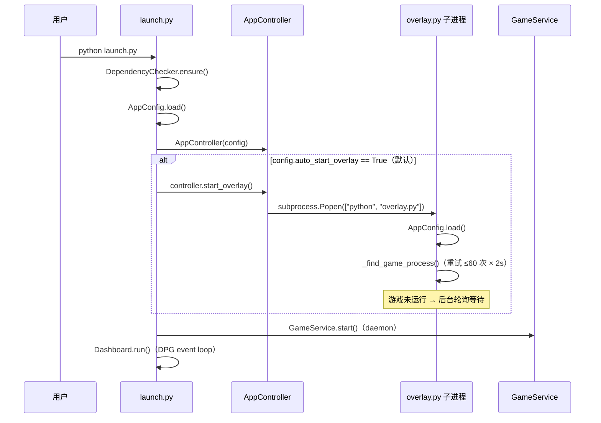
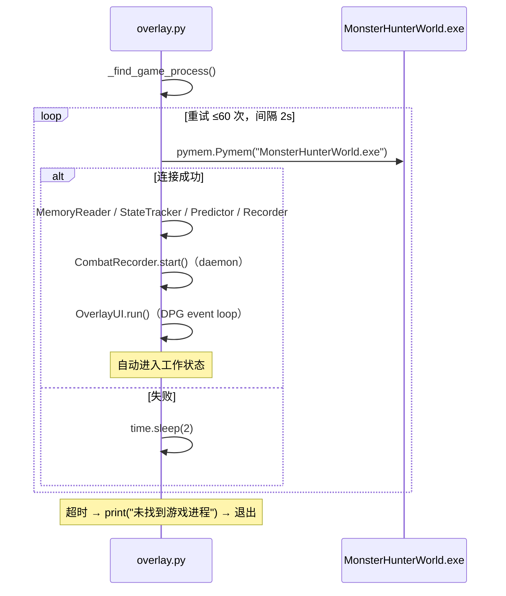
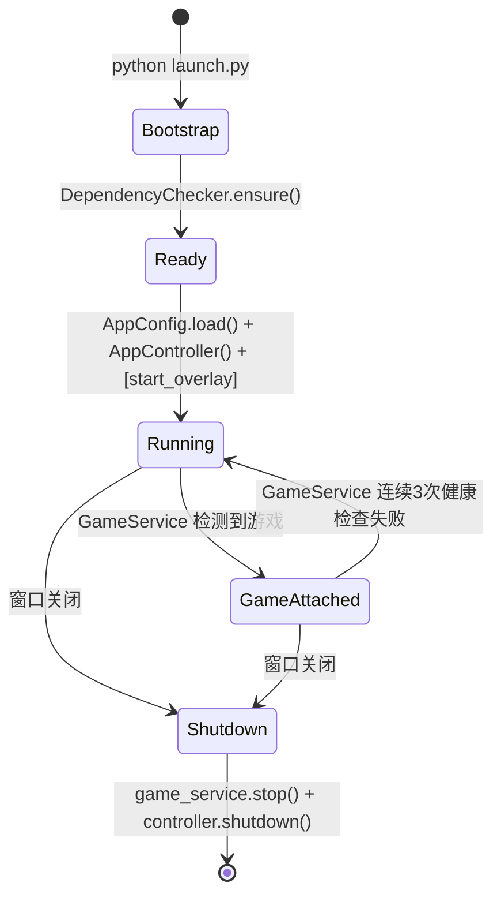

# Process Architecture — BlackDragon v1.0

> 双进程 + 多线程模型与生命周期（基于 ADR-P5.2 / ADR-P5.3 与当前源码）。

## 1. 双进程动机

DPG 2.x 使用 GLFW 窗口后端。GLFW 要求所有 `glfwCreateWindow()` 调用在**初始化库的主线程**执行；非主线程创建窗口 → 未定义行为 → 崩溃。

P5.2 尝试了三种进程内方案均失败（详见 ADR-P5.2）：

| 方案 | 失败原因 |
|------|----------|
| A: 单 context + `create_viewport()` 多视口 | DPG 2.x 的 widgets 只渲染在主视口，次视口空白 |
| B: Overlay daemon 线程 + 独立 DPG context | GLFW 非主线程创建窗口 → 崩溃 |
| C: OverlayService + `queue.Queue` 命令路由 | 同 B——命令路由不改变 GLFW 调用线程 |

**决策**：进程级隔离——每个进程有自己的 DPG context + 主线程（ADR-P5.2）。

## 2. 启动时序（P5.3 auto-start）

**Overlay 连接游戏**（ADR-P5.3 方案 A）：

## 3. Dashboard 进程线程模型

| 线程 | 类型 | 职责 |
|------|------|------|
| Main | 主线程 | DPG event loop（`Dashboard.run()`）——刷新状态栏/日志/训练/CSV/按钮 |
| GameService | daemon | 2s 轮询游戏进程 → `attach_game` / `detach_game` |
| Recorder | daemon | 0.1s 录制帧（仅在游戏附着后存在） |
| Training reader | daemon | 训练子进程 stdout 轮询 → 队列（可选，训练时） |
| — | 子进程 | `overlay.py`（独立进程） |
| — | 子进程 | `train_lgbm.py`（训练时启动） |

## 4. Overlay 进程线程模型

| 线程 | 类型 | 职责 |
|------|------|------|
| Main | 主线程 | DPG event loop（`OverlayUI.run()`）——每帧 `update_logic()` |
| Recorder | daemon | 0.1s 录制帧（CombatRecorder） |

## 5. 进程生命周期状态机

### 附着 / 分离细节

**attach_game（GameService 线程调用）**：
1. `MemoryReader(pm, base)` — 内存读取
2. `CombatStateTracker(is_recording=config.auto_record)` — 状态（ADR-P5.3）
3. `ActionPredictor(config.model_path)` — 模型
4. `deque + Lock` — 通信通道
5. `CombatRecorder(...)` — 录制
6. `recorder.start()` — 启动 daemon

**detach_game**：`recorder.stop()` → 清引用。**不**终止 Overlay 子进程（独立进程，用户手动关闭）。

### shutdown（Dashboard 退出）

`launch.py` finally 块执行：

1. `game_service.stop()` — 停止 GameService 后台检测线程
2. `controller.shutdown()` — 内部步骤：
   a. `recorder.stop()` — 停止 CombatRecorder daemon
   b. `overlay_proc.terminate()` — 终止 Overlay 子进程（如运行）
   c. `training_proc.terminate()` — 终止 Training 子进程（如运行）

## 6. 跨进程状态同步策略（ADR-P5.2）

| 数据 | 机制 | 说明 |
|------|------|------|
| Recording state | 独立 per-process | 每个进程自己的 `state_tracker.is_recording`；Dashboard checkbox 只控制 Dashboard 进程的 Recorder |
| Combat data (CSV) | 各自写入 `data/` | 独立 CombatRecorder 实例，独立文件 |
| Model status | 各自加载 `models/fatalis_ai_model.pkl` | 文件存在性检查 |
| Log events | `blackdragon.log` | 共享文件日志 |
| Config | 各自独立加载 `blackdragon_config.json` | 启动时快照，运行时不同步 |

## 7. 关键约束

- **P4 core 零修改**：`src/core/`, `src/model/`, `src/data/`, `main.py` 不随进程架构改动
- **不恢复进程内 Overlay**：Overlay 始终是独立子进程（ADR-P5.2 决策）
- **无全局状态**：跨进程通信仅通过文件（config / CSV / log），无共享内存或 IPC
