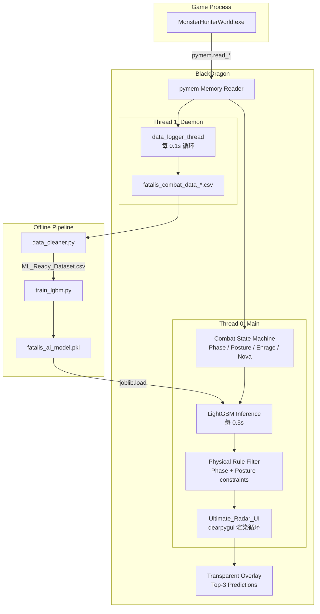

# System Architecture

## 概述

BlackDragon 采用 **Pipeline Architecture（管线架构）**，各模块通过文件系统耦合，无代码级 import 依赖。核心流程分为两大线程并行运行：**数据录制线程**（daemon）和 **UI 渲染线程**（main）。



## 核心组件

### 1. 内存读取层

- **实现**: `ai_engine.py` 中的 `get_ptr()` 和 `find_monster()`
- **功能**: 多级指针解引用、遍历 10 个怪物槽位、读取 HP/坐标/动作/发怒数据
- **依赖**: pymem, `src/config/offsets.py` (23 个偏移量字段)

### 2. 状态机层

- **Phase 状态**: 根据 HP% 推导（P1: >78%, P2: 50-78%, P3: <50%）
- **Posture 状态**: 5 态 FSM（站立/趴下/飞行/倒地/演出），由招式触发切换
- **Enrage 状态**: 硬件级直接读取引擎内部秒表（`0 < timer < max`）
- **Nova 状态**: HP 阈值 FSM（78%/50%/41%/26%/6%），特定动作重置 warning

### 3. 数据录制层

- **实现**: `data_logger_thread()` — daemon 线程
- **频率**: 每 0.1s 写入一行 CSV
- **输出**: `data/fatalis_combat_data_YYYYMMDD_HHMMSS.csv`
- **列**: timestamp, hp_percent, phase, is_enraged, distance, relative_angle, posture, action_id

### 4. AI 推理层

- **模型加载**: joblib.load("models/fatalis_ai_model.pkl") ≈ 18MB
- **推理频率**: 每 0.5s（动作变化时立即触发）
- **输入特征**: 6 维（distance, relative_angle, posture, previous_action, phase, is_enraged）
- **两层预测架构**:

```
model.predict_proba(features)
    → Phase Filter (阶段不合法→概率 0)
    → Posture Filter (姿态不合法→概率 0)
    → Renormalize (重归一化)
    → Top-3 (概率 > 3%)
```

### 5. UI 渲染层

- **框架**: dearpygui 2.3
- **窗口属性**: 420×350, 无边框, 置顶, 背景透明, 鼠标穿透
- **位置**: 屏幕右上角 (width-440, height×0.25)
- **显示内容**: 动作名、Phase/Enrage、距离/角度/HP%、Nova 警告（红色）、AI Top-3（绿色）

## 线程模型

```
Thread 1 (daemon): data_logger_thread()
  ├─ 每 0.1s: read memory → compute → write CSV → append action_buffer
  ├─ 有 lock 保护 action_buffer 写入
  └─ shared_state 无锁保护（已知技术债 #5）

Thread 0 (main): Ultimate_Radar_UI.run()
  ├─ dearpygui render loop: update_logic() every frame
  └─ read memory → state update → AI prediction (every 0.5s) → render overlay
```

## 模块间依赖

> [!note] 关键设计
> 模块间**无代码级 import**，全部通过**文件系统耦合**：
> - `ai_engine.py` → 写入 CSV → `data_cleaner.py` 读取
> - `data_cleaner.py` → 写入 ML_Ready_Dataset.csv → `train_lgbm.py` 读取
> - `train_lgbm.py` → 写入 .pkl 模型 → `ai_engine.py` 加载

## 目录映射

| 目录 | 内容 | 说明 |
|------|------|------|
| `src/config/` | actions.py, offsets.py | 唯一数据源（动作 DB + 偏移量） |
| `src/` | logging_config.py | 统一日志配置 |
| `data/` | 原始 CSV + ML_Ready_Dataset.csv | 战斗数据（gitignored） |
| `models/` | .pkl 模型 + feature_importance.png | 训练产物（gitignored） |
| `tests/` | 7 个测试文件 + conftest.py | pytest 测试套件 |
| `archive/` | mod.py | 已废弃的旧版悬浮窗 |
| `docs/` | 参考文档 | 招式表、偏移量指南等 |

## 已知技术债

参见 [[../docs/Tech_debt|Tech Debt]] 完整清单：

- #4: God Class — ai_engine.py 承担 5 种职责（计划 P4 拆解）
- #5: 全局可变状态无锁保护（P4 引入 CombatState 类）
- #6: 无模型版本管理（P5 实现）
- 更多见 [[Development/Refactoring_Roadmap|Refactoring Roadmap]]
