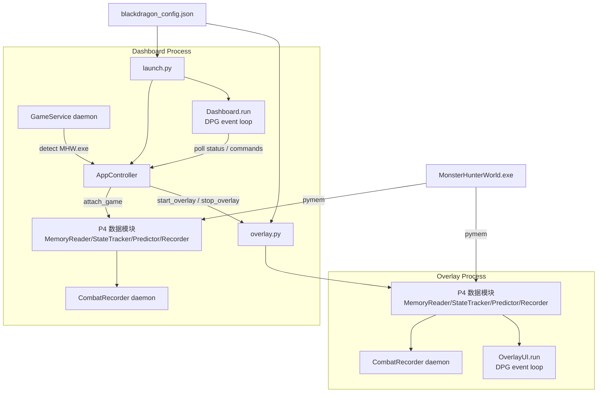

# System Architecture — BlackDragon v1.0

> 本文档描述**当前（P5.3 auto-start）**系统拓扑。历史架构见 `docs/legacy/architecture-v0/`。

## 1. 进程结构总览

BlackDragon v1.0 采用**双进程架构**（ADR-P5.2）：Dashboard 与 Overlay 是两个独立的 Python 进程，各自拥有独立的 DPG context 与主线程。

```
┌─────────────────────────────────────────────────────────────┐
│  Process 1: python launch.py  (Dashboard 控制中心)            │
│  ┌─────────────────────────────────────────────────────┐    │
│  │ launch.py (composition root)                        │    │
│  │   ├─ DependencyChecker.ensure()  → 环境检查          │    │
│  │   ├─ AppConfig.load()            → 配置加载          │    │
│  │   ├─ AppController(config)       → 生命周期协调       │    │
│  │   ├─ [auto_start_overlay]        → spawn overlay.py  │    │
│  │   ├─ GameService(controller)     → 后台游戏检测       │    │
│  │   └─ Dashboard(controller).run() → DPG event loop    │    │
│  └─────────────────────────────────────────────────────┘    │
│    ├─ src/app/    AppController / AppConfig / GameService   │
│    ├─ src/dashboard/  Dashboard / StatusBar / LogView /     │
│    │                 TrainingPanel                          │
│    └─ src/bootstrap/  DependencyChecker                     │
└─────────────────────────────────────────────────────────────┘

┌─────────────────────────────────────────────────────────────┐
│  Process 2: python overlay.py  (透明覆盖层)                  │
│  ┌─────────────────────────────────────────────────────┐    │
│  │ overlay.py (composition root)                       │    │
│  │   ├─ AppConfig.load()           → 配置加载            │    │
│  │   ├─ _find_game_process()       → 重试连接游戏        │    │
│  │   ├─ MemoryReader / StateTracker / Predictor /      │    │
│  │   │  Recorder (P4 模块)                              │    │
│  │   ├─ CombatRecorder.start()     → daemon 录制        │    │
│  │   └─ OverlayUI.run()            → DPG event loop     │    │
│  └─────────────────────────────────────────────────────┘    │
│    ├─ src/core/   MemoryReader / CombatStateTracker         │
│    ├─ src/model/  ActionPredictor                           │
│    ├─ src/data/   CombatRecorder                            │
│    └─ src/ui/     OverlayUI / setup_cjk_font                │
└─────────────────────────────────────────────────────────────┘
```

### 为什么双进程？

DPG 2.x 使用 GLFW 作为窗口后端，GLFW 要求所有 `glfwCreateWindow()` 调用在**主线程**执行。单进程内无法同时运行两个窗口化 context（见 ADR-P5.2 三种失败方案）。进程级隔离使每个进程有独立的 DPG context + 主线程。

## 2. 外部依赖

| 依赖 | 说明 |
|------|------|
| `MonsterHunterWorld.exe` | 游戏进程（pymem 连接） |
| `blackdragon_config.json` | 共享配置（两个进程各自独立加载） |
| `data/` | 录制 CSV 输出目录 |
| `models/fatalis_ai_model.pkl` | AI 模型（两个进程各自加载） |
| `C:/Windows/Fonts/msyh.ttc` | CJK 字体（中文渲染） |

## 3. 组件交互（Mermaid）



## 4. 离线管线（独立脚本，非进程内）

```
data/fatalis_combat_data_*.csv  (17+ 个录制文件)
        │
        ▼  data_cleaner.py  (动作合并 / 姿态追踪 / 派生提取 / 过滤)
data/ML_Ready_Dataset.csv
        │
        ▼  train_lgbm.py  (LightGBM 多分类训练)
models/fatalis_ai_model.pkl  +  models/feature_importance.png
```

## 5. 与 legacy 的关系

| 入口 | 状态 | 说明 |
|------|------|------|
| `launch.py` | ✅ 推荐 | 双进程控制中心 |
| `overlay.py` | ✅ 推荐 | 独立覆盖层进程 |
| `main.py` | ⚠️ legacy | P4.6 composition root（单进程 overlay） |
| `ai_engine.py` | ⚠️ legacy | God Class，保留供 P3 测试导入与回退 |

P4 模块（`src/core/`, `src/model/`, `src/data/`, `src/ui/overlay.py`）自提取后保持零改动（dual-track 约束）。

## 6. 目录映射

| 目录 | 内容 | 进程 |
|------|------|:---:|
| `src/core/` | state_tracker, memory_reader | 双进程 |
| `src/model/` | predictor | 双进程 |
| `src/data/` | recorder | 双进程 |
| `src/ui/` | overlay, fonts | 双进程（`fonts.py` 被两个进程共享） |
| `src/app/` | controller, config, game_service | Dashboard |
| `src/dashboard/` | main_window, status_bar, log_view, training_panel | Dashboard |
| `src/bootstrap/` | checker | Dashboard |
| `src/config/` | actions, offsets | 双进程（唯一数据源） |
