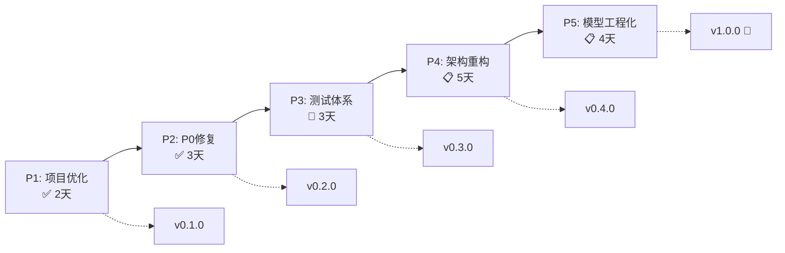

# Refactoring Roadmap

## 概述

BlackDragon 从单体脚本演化为可发布的工业级开源项目，分为 5 个阶段。每阶段结束后项目保持可运行。

> [!note] 来源
> 本文档是 [[../docs/Refactoring_roadmap|完整路线图（1022 行）]] 的精简摘要。详细任务清单和代码示例见原文件。

---

## 5 阶段总览



---

## P1: 项目标准化 ✅

> **原则**: 纯增量操作，不改一行核心逻辑。

| 操作 | 说明 |
|------|------|
| 新建 README, .gitignore, requirements.txt, CHANGELOG | 项目基础设施 |
| 目录重组 | data/, models/, archive/, docs/, tests/ |
| 路径更新 | 所有 Python 脚本适配新目录结构 |
| 手工验证 | data_cleaner → train_lgbm → ai_engine 全链路 |

**Tag**: `v0.1.0-project-init`

---

## P2: P0 关键修复 ✅

> **原则**: 每个修复独立 commit，可单独回滚。

| 子任务 | 修复的 Tech_debt | 说明 |
|--------|-----------------|------|
| P2.1 异常日志化 | #3 静默异常吞噬 | `except: pass` → `logger.*()` |
| P2.2 ACTION_MAPPING 统一 | #2 三处重复定义 | 合并到 `src/config/actions.py` |
| P2.3 偏移量配置化 | #1 魔法数字硬编码 | 合并到 `src/config/offsets.py` |
| P2.4 姿态 FSM 统一 | 审计发现 | POSTURE_STAND/PRONE/FLY 集中 |
| P2.5 train_lgbm 修复 | P2.1 遗漏 | 裸 except → logger.error |
| P2.6 enrage 修复 | P2.1 遗漏 | 3 处裸 except → except Exception |

**Tag**: `v0.2.0-p0-fixes`

---

## P3: 测试体系 🔄

> **原则**: 只测纯逻辑（不依赖游戏进程），先建安全网再重构。

### P3.1-P3.3: ✅ 已完成

- 8 个纯函数提取（距离/角度/Top-K/过滤器/Nova）
- 7 个测试文件，147 个测试，100% 通过
- Config 模块 100% 覆盖
- ai_engine.py 43% 覆盖

### P3.4: 🔄 进行中

集成测试目标（3 个文件）:
- `data_cleaner.py` — CSV → ML-ready ETL
- `data_upgrade.py` — 旧数据 phase/enrage 回填
- `train_lgbm.py` — 模型训练管线

### P3.5: 📋 待进行

- CI 完整验证
- 覆盖率 ≥ 60%

**Tag**: `v0.3.0-test-safety-net`

---

## P4: 架构重构 📋

> **目标**: 将 God Class (ai_engine.py) 拆分为 5 个独立模块。

### 拆分计划

```
ai_engine.py (484 行)
    │
    ├── Step 4.1: StateTracker    → src/core/state_tracker.py
    ├── Step 4.2: MemoryReader    → src/core/memory_reader.py
    ├── Step 4.3: CombatRecorder  → src/data/recorder.py
    ├── Step 4.4: ActionPredictor → src/model/predictor.py
    ├── Step 4.5: OverlayUI       → src/ui/overlay.py
    └── Step 4.6: Main Assembly   → main.py
```

### 目标结构

```
src/
├── core/
│   ├── memory_reader.py    # 游戏内存读取封装
│   └── state_tracker.py    # 战斗状态机（线程安全）
├── data/
│   └── recorder.py         # CSV 录制
├── model/
│   └── predictor.py        # AI 推理
├── ui/
│   └── overlay.py          # 悬浮窗
└── config/
    ├── actions.py           # 动作数据库
    ├── offsets.py           # 内存偏移量
    └── settings.py          # 应用配置（新增）
```

**Tag**: `v0.4.0-architecture-refactor`

---

## P5: 模型工程化 📋

> **目标**: 工业化模型训练管线，达到 GitHub 发布标准。

| 子任务 | 说明 |
|--------|------|
| 5.1 模型版本管理 | 文件名加时间戳 + metadata.json |
| 5.2 增量学习 | LightGBM `init_model` 参数 |
| 5.3 数据版本管理 | CSV 加 `schema_version` 列 |
| 5.4 文档与发布 | CONTRIBUTING, LICENSE, 完整 docs/ |
| 5.5 CI/CD 完善 | lint, test, release workflows |

**Tag**: `v1.0.0-github-release` 🚀

---

## 里程碑总表

| Phase | 名称 | 工作日 | 累计 | Tag |
|-------|------|--------|------|-----|
| P1 | 项目标准化 | 2 | 2 | v0.1.0 |
| P2 | P0 修复 | 3 | 5 | v0.2.0 |
| P3 | 测试体系 | 3 | 8 | v0.3.0 |
| P4 | 架构重构 | 5 | 13 | v0.4.0 |
| P5 | 模型工程化 | 4 | 17 | v1.0.0 |

**总预估**: 17 个工作日（约 3.5 周）

## 约束与原则

1. **每阶段结束可运行** — `python ai_engine.py` 必须能启动
2. **先建安全网** — 日志 → 测试 → 重构，不跳过
3. **渐进式改进** — 每次改动控制在 2-3 个文件
4. **Tag 驱动** — 每阶段打完 tag 再进入下阶段

## 相关文档

- [[../docs/Tech_debt|Tech Debt — 14 项技术债清单]]
- [[../docs/Refactoring_roadmap|完整 Refactoring Roadmap (1022 行)]]
- [[Development_Log|Development Log — 时间线]]
- [[../memory_bank/activeContext|Active Context — 当前状态]]
